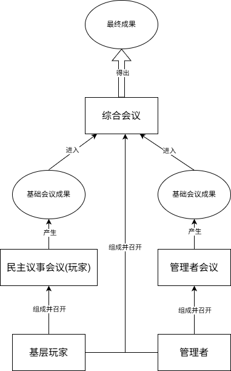
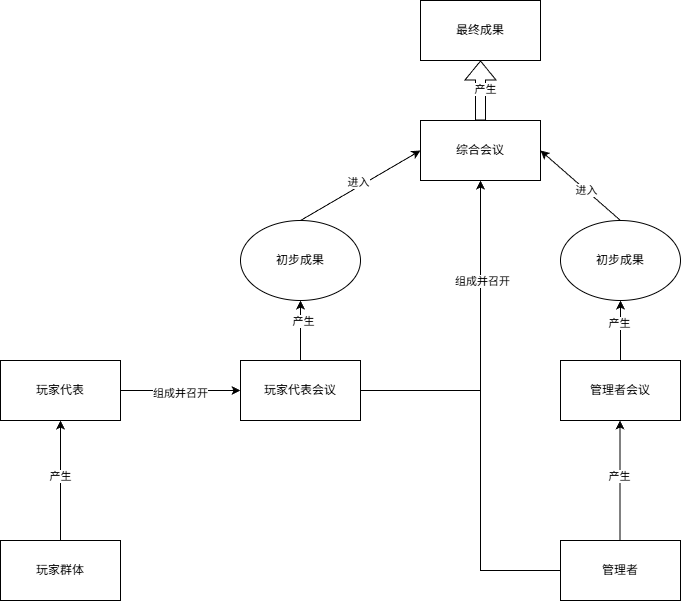
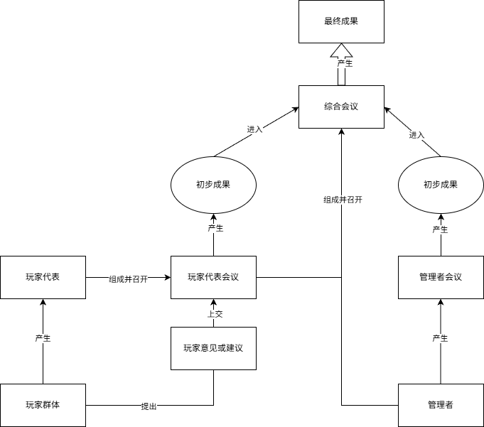
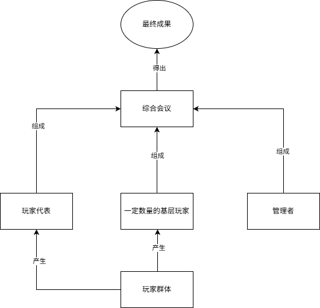
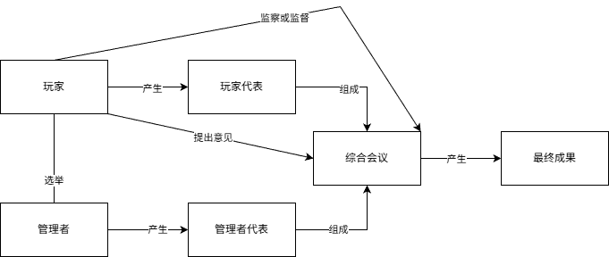
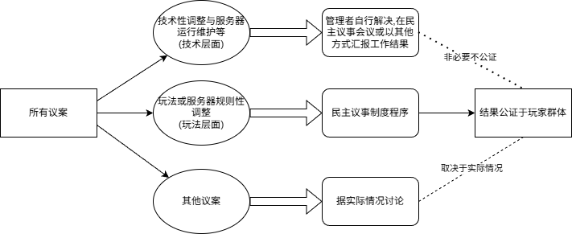

---
prev:
  text: '01.管理思维论'
  link: '/ServerOutlineOfTheTheoryOfHumanitiesGovernance/01-ManagementThinking'
next:
  text: '03.管理层体制论'
  link: '/ServerOutlineOfTheTheoryOfHumanitiesGovernance/03-ManagementSystem'
---
## 02.民主议事论
### 引言与玩家提议
根据管理思维论的相关内容,我们知道要想管理好服务器,就必须协调各方,充分利用玩家的力量与智慧.要想充分利用玩家的力量与智慧,首先就是确保玩家能够提出意见,随后管理者也必须要积极客观地去思考该意见的可行性,防止其脱离了实际,最后管理者才能够尽自己努力去将意见落实下来.

我们可能会有疑问:为什么要说"确保玩家提出意见",这难道不是废话吗?实际上,忠言逆耳,如果该玩家提出的意见是带有批判性的,甚至可能言论偏激了一些,一些管理者可能拒绝接受这样的意见,与该玩家产生冲突,这样玩家群体就自动的认为本服务器的管理者听不进去意见.另一种可能则是该玩家提出了意见,但是管理层以一种消极的态度应对,比如"你行你上","有本事打钱"之类的话语或者直接不回应,显然,玩家群体也就认为在这个服务器提出建议是不太现实的.

当然也有一种很大的可能,就是玩家们已经游玩过别的服务器,并且受过影响,"不敢"提出意见,实际上就是受"神权"服务器影响(特权化管理的服务器),这种情况我们就要先塑造一种良好的服务器沟通环境,让玩家意识到提出意见是正当合理的,不需要害怕,比如践行一套良好的民主议事体系,或者经常展示服务器玩家提议的落实情况等.大多数玩家也很快就能融入到这种环境中. 思考该意见的可行性也是很重要的一环,例如如果某个服务器是个公益服务器,资金不太充足,此时玩家直接想要服务器硬件配置升级,那显然也是不太现实的,因为压根没有充足的客观条件去满足玩家的想法,此时我们也应该保持理智,耐心与玩家沟通,说明现实情况,而不是直接骂回去:"我们这破服务器又没钱,有本事你自己拿钱来".其他场景也是同理,如果我们以一种消极或者偏激的态度去回应玩家的想法,玩家群体也很快就会意识到提议是不可行的.

另一种情况就是玩家的提议直接不符合服务器的硬性规定,或是明显的不合情理.比如在无规则服务器里提出装载领地插件,希望服务器允许矿透(如果该服务器明确禁止)等,这就需要根据实际情况考虑,一般情况下,管理者也应以积极的态度回应玩家,向玩家解释其不可行的原因.
不论如何,如果管理者的回应做到了"及时到位",但玩家的态度却十分恶劣,或是其拒绝或破坏合理的民主议事,则可以对个别玩家实行符合服务器规定的管理手段.

至于落实,则是必须干到实处,而不是搞面子工程,必须以实际的成果去回应玩家的需求.否则,玩家的希望就会落空,最后也就觉得管理者"反正提议了也就那样随便应付",很快,玩家群体也就停止提出建议了.

据上文,我们知道让玩家提议是很重要的,毕竟"当局者迷旁观者清",我们需要玩家这一面"镜子"去反照自己管理的不足,但是怎么用好玩家这面"镜子"呢?显然,在服务器里建立民主议事制度就是非常好的解决方法.

### 民主议事的非必要性
什么是民主?在现实中,民主是人民所享有的参与国家事务和社会事务管理或对国事自由发表意见的权利.什么是民主制?民主制是一种和君主制相对的制度,民主制的官员,议员分权,官员和议员是民众的受托人,而非官天下.

但是现实中的民主制是要与当时时代的经济基础相适应的,在服务器管理中也必然要适应服务器的具体实际,那么什么情况下民主议事制度就不太可能建立或正常运行呢?我认为主要有以下几种情况:

①服务器的玩家活跃度过低.这种情况下玩家根本无法参与到实际的民主活动,这时服务器的首要目的应当是想办法提高玩家活跃度,而不是先搞一套民主议事制度,但是其确实可以对外宣传要建设一套民主议事制度,从而激发玩家的活力.

②管理者实际上没有办法真正直面提议.比如有些管理者态度确实不是很好,并且改过的概率很低,或是有些管理者对于提议这件事非常敏感,不太能接受他人的批判,或是其他实际情况导致管理者实际上没有办法接受玩家的提议.

③心中实际上并不想搞好民主议事的,或是想利用其来满足自己的特权化管理的,或是只是想要给自己服务器盖一个民主帽子的(实际上只是"参考"意见而不执行).显然,其很快就会与玩家群体产生冲突,从而导致该制度无法运行.

④曾经尝试过各种民主议事体系,但是都失败的.这可能是服务器实际情况确实不支持民主议事的实行,那倒也不必非要尝试建立民主议事制度,最后大概率只能建立了一个空壳.

如果服务器的实际情况确实不足以支撑民主议事这一制度的顺利运行,我们也可以借助本章节的一些思想原则等进行符合服务器实际情况的创新,去建立符合服务器实际情况的管用的可以充分吸取玩家合理意见与建议的制度,从而推动服务器的长远发展.
### 民主议事原则
那么,民主议事制度要有什么原则?这需要取决于服务器实际情况,但是我认为至少有以下几个原则是通用的:

①平等性:所有人都是平等的,所有玩家不应该遭到任何歧视.我们不能因为一个玩家看起来发言好像很"蠢",就不让他提议,或是因为一个玩家曾经违反过服务器规定而被惩戒过而禁止其民主议事(除非极其严重),还有其他玩家也是如此,只要没有特别重大的原则性的问题,所有人应当平等参与议事.

②真实性:这个民主议事制度必须要以真实履行,而不是摆在那里当空壳子,实际上根本不践行.此外,管理者也必须真正的去思考提出的意见,而不是当耳旁风,并对其意见作出积极的有效的反响.

③非强制力量过度干涉性(自由性):民主议事制度不能因为任何人一句话就强制失效或被终止,哪怕是服主,其只能在必要时刻(如陷入僵局时)才能强制干涉.

④民主性与管用性:玩家们提出意见,应该先进行民主讨论,而不是只提意见不讨论,或是不顾实际就提出空谈,这样只会给管理者增加不必要的麻烦.此外,玩家们也必须能真正的做到民主提议,而不是被各种强制力量制约.

⑤综合性(广泛性):我们不能只针对于玩家群体而设置民主议事,也要去设立管理者内部的民主议事,再加上管理者和玩家间的民主议事,三者相合一,做到在多力量中心制衡的格局中以这种民主形式尽可能超越冲突对立.

⑥合理性:其必须符合实际条件,必须在完全合法的情况下,不得干涉任何人的现实生活中的合法权益.

### 民主议事基本组织形式
那么,民主议事制度体系都有什么组织过程形式?我们来看几个简单的基础民主议事体系:

一:基础体系(如下图):

这种体系是最基础的,根据上述原则描述构建的,适用于服务器玩家数量较少的情况,因为这是一种直接民主,所有玩家都参与,玩家基数增大时就不再适合了.
### 代议制及玩家代表选举
二:代议制基础体系(如下图):

这适用于玩家数量较多的情况(玩家数量过多,直接民主就显得十分混乱).但是,代议制的玩家代表需要被玩家选举产生,这也是一大难点.一般来说,玩家代表的产生有以下几种途径(没有哪种途径是最好的,只有最合适的,我们也不必局限于这几种途径):

①选贤与能制(一定程度上类似于中国古代西汉的察举制):玩家可以推荐他人或自荐,或由管理者任命,或在某次民主议事时通过选举某人成为代表的议案.这种制度根据玩家的能力和素质,以及其在服务器中的活跃程度,引领力和代表力等来确定玩家代表的资格.不过,受限于玩家团体化影响,这可能会使得"选贤与能"变成了玩家团体争权夺利,扶持傀儡为自己团体谋利的手段,管理者也有可能被贿赂,或是由于其他问题而"推举"其成为代表,故本方法需要有一个严格的监察体制来监督其合理运行.

②轮流任期制:每个玩家可以轮流担任代表,担任一段时间将其位置自动轮换给下一个玩家.这种制度的优势在于,玩家可以在短时间内就产生一个新的代表,且完全按照轮换规律.但是,如果代表轮换过快,代表的影响力就不足,也不一定真正能代表玩家,轮换过慢,玩家参与度就不高,且如果玩家基数很大,也不适合使用本制度.且其无法保证玩家代表的个人素质情况,故本制度只适合玩家综合素质较高,人数合适的情况.

③考核制:玩家需要参与管理者设定的考核,符合标准的可以成为代表.这种制度可以确保玩家代表的素质,但是选举的玩家代表人数不多,且玩家参与度普遍不高.如果管理者设置不当,则其直接失效,成为一个空壳.

④半选举制:管理者指定部分候选代表,根据玩家民主投票结果,指定代表,缺点类似于"选贤与能制",且要求管理者的初次选举合理.

⑤禅让制:上一届玩家代表可以禅让给某位玩家,若双方同意,则该玩家就成为代表,同理其缺点类似于"选贤与能制",这一过程一般需要配合其他玩家的监督.

⑥民主议事选举制:通过玩家的直接民主产生基本候选人,再根据玩家的民主投票结果,产生最终的代表.这种制度的优势在于玩家产生的代表一般来说个人素质较高,缺点类似于"选贤与能制",且难以在极多人参与的情况下产生代表.

⑦代表选举制:(只适用于极多玩家)将玩家划分为数个组织,每个组织产生一定量代表,每个组织代表的代表数不能超过其玩家数的一定比例(如百分之十),这些玩家代表再次参与选举,直到最终数量合理时确定玩家代表,缺点是选举时间较长,要求管理者组织动员力度大.

⑧混合制:如百分之四十五的选举代表(体现民意),百分之三十五的功能代表(如建筑大师,红石生电专家等按专业能力任命),百分之二十的随机代表(抽签产生,防止派系固化).

实际上,代表的产生制度不局限于此,管理者也可以根据实际情况,采用其他合理的方式产生代表,但其一般需要遵循以下基本准则:

①民主性与管用性:代表的产生必须要符合民主议事的原则,不能因为管理者的强制力量而影响到玩家的民主议事.

②透明性与公正性:代表的选举,产生必须公开合理.

③注重代表的个人素质:代表必须要有一定的个人优势,必须遵守服务器规定等,必须有一定的游玩经验,理性与独立思考能力等,且其必须代表大多数玩家的意愿.

④代表的选举原则:代表的选举必须遵循公平,平等,直接,公开,竞争,择优,公正等原则.

⑤任期:一般代表需要固定任期,不宜过长或过短,除非其极为优秀或被玩家认可,否则不应持续连任.

⑥权力与责任:代表个人必须合理利用权力,担当起代表玩家的责任,以免影响到玩家的正常游戏.

⑦非强制性:代表的选举不是强制的,玩家可以拒绝成为代表.

⑧实际性:代表的产生必须考虑到实际情况,不能盲目追求理想的结果.

一般来说,管理者需要广泛观察玩家的实际游玩,知晓服务器的实际格局,并根据其情况,合理设置代表的选举制度,从而推动民主议事制度的完善.
### 综合性民主议事体系
三:代议制广泛民主体系(如下图):

这实际上是将玩家群体的意见上交给玩家代表,而不是玩家代表自己提意见,这有利于玩家代表更好反馈民意,但也加大了玩家代表的工作量.

四:综合式民主体系(如下图):

这种制度将管理者,玩家群体,玩家代表均纳入一个会议,可以提高效率,便于不同群体的交流沟通,但是也增加了管理难度,实际操作不当可能会大大降低议事效率.

此外,管理者也不一定需要全员参与,可以根据实际情况产生管理者代表(如果管理者有一定数量),其可代表管理者参加民主议事.

五:玩家力量特化民主体系(如下图):

这一体系注重玩家的力量,代表均由玩家产生,且玩家可监督或监察综合会议,其意见可直接提交给综合会议,但也会导致一些情况下的僵局,应当保留如服主或数个"德高望重"的资深玩家的最高否决权.

### 民主议事的首要目的
总之,不论选择什么民主议事体系,其核心理念都是要让玩家群体的意见得到充分的反馈,并通过民主的制度让管理者和玩家群体共同决定服务器未来走向,协调各方力量,以民主议事制度促进游戏的发展,控制管玩矛盾,超越管玩立场对立.

民主议事体系实际上可以看作管理者对玩家的妥协,尽管玩家没有办法直接导致服务器灭亡,但是玩家本身就是服务器存活的基础,故玩家的态度和选择对服务器的发展至关重要,不同的民主制度,实际上是其服务器具体格局与性质的体现,管理者必须根据实际情况,设计合理的民主议事体系,打造优良的服务器社区风气,从而进一步改善管玩关系,维护服务器的长久发展.

### 民主议事的局限性
那么,辩证地来看,任何民主议事体系就都没有缺点吗?

首先,民主议事需要"确保有玩家提议",但在服务器中,玩家具有高流动性,可能刚提完建议就退了或者没再也消息了,那么此时该怎么办?或者玩家代表也是如此,又该怎么处理?显然,这个问题没有固定答案,只能根据实际情况,采用合理的方式处理.同时,我们也应当设置一些紧急程序制度(比如设置自动的离职交接等保障制度),用以解决这种情况.不过一般来说,如果提议玩家走了,但是其建议如果确实合理且可执行,有必要对其保留,如果玩家代表走了,则应当自动将其权力交与其他代表或是暂放回管理者团队.

我们确实提到了玩家可能沉默,也说明了要建立合理的风气促进玩家提问,但如果玩家依然沉默呢?或许对于提议的冲击不是很大,但如果服务器实行代议制,玩家代表的选举投票率都很低,那么该怎么处理?一般来说,如果投票率低于总玩家数的百分之十五,则应当认为服务器不适合民主议事制度,因为此时玩家活跃度过低,应该采取其他管理制度,或是采用"消极同意机制",即认为议事结果本身是无异议的,在一定时间内无人提出质疑则自动视为无异议通过,或搁置该议案(需根据实际情况考量是否适用).无论如何,依然是要结合实际,建立符合实际的民主议事制度或采取其他管理制度.

当出现突发危机,还要民主议事吗?这显然不合理,其也没做到"具体问题具体分析",管理者有权保证一定内容下的强制执行权力而中止民主议事,比如突发的服务器重大漏洞或是秩序崩溃等,但是其必须在危机结束后对玩家群体做出反馈,且需预设民主议事制度的恢复条件和问责机制,严格检查强制力量的合理性,防止"临时措施"永久化.

一般情况下,民主议事可以提高效率,但是如果会议中"事事都议",那么议事效率就会被拖垮,我们应当确保一些非必要议题的直接处理并在民主议事会议中(或以其他方式)汇报工作成果,统筹民主与高效,而不是讨论后再工作,这也符合马克思主义哲学矛盾论中的"具体问题具体分析"的方法论.
### 实践案例:议题分级制度
一般来说,议题分级制度可以有效地区分不同议题的优先级(如下图),但是每个服务器也应当根据其实际自行选择合适的解决方法.

值得注意的是,如果某一议题存在技术和玩法交织的问题,那么也应当保持对玩家的公开性,对于实际游玩存在影响的应当保有原有的民主议事机制,当然,管理者也可自行设置相关的适合服务器的处理机制.对于其他议案,只要设计玩家利益,则必须公证于玩家.

据上文,我们知道玩家团体化可能会威胁民主议事制度的公正合理,这取决于游戏服务器的自身特性,使得玩家团体基于玩家共同利益天然形成,且玩家代表选举成本极低,信息代差严重(新玩家难以摸清实际情况),且玩家团体化本身不可阻挡或逆转,这将是服务器民主议事制度的一个长期的挑战,我们也应当建立一些反团体化机制,反团体化机制,如限制同公会成员在代表中的比例(比如百分之十至百分之十五),但这也离不开管理者的实际考察.

### 民主议事与管玩矛盾
民主议事并非消除管玩矛盾,而是将不可调和的利益冲突转化为可控制的程序对抗,从而平衡管理者和玩家群体,维持多力量中心的制衡,其实际上是管玩矛盾的一种缓解方案,玩家群体并不能做到完全自治,管理者也不能真正依靠这一种制度做到"站在玩家的立场看问题",因此其更类似于一种管理者对玩家的妥协,也是管理者保证多力量中心制衡格局稳定的一种手段.

民主议事是"妥协",而妥协意味着双方都在一定程度上要放弃部分最优解,服务器的消亡可能并非因为管玩矛盾集中爆发,而是因为民主制度僵化为形式主义,导致"多力量中心"退化为"单边形式主义",当该格局彻底失去平衡,服务器也就走到了其发展的末路,其不一定会直接"死亡",但是一定会停止"发展",最终被"遗弃".这也说明了任何一种制度体系都不一定会让服务器更好或更坏,真理与谬误往往相伴而行,真理超出了其适用范围就会变为谬误,所以我们更应该注重实际情况而不是去固执地寻找并机械地教条地遵循"普遍的真理",一定要随着实际情况的变化而调整制度体系.

我们必须承认,在服务器管理中,权力是不平等的,管理者始终有极高的权力,哪怕这样的民主制度,其照样可以直接宣布无效,而玩家虽然看似是被动的,但其却是服务器的生命的源泉,没有了玩家,对外开放的服务器就失去了其意义,这就是玩家最大的"杀手锏",也是管理者"绝对权力"也踏不过去的高山.我们或许做不到最好的治理,但却可以通过程序设计实现最不坏的治理,让服务器像这样一步一步地走向未来.

### 总结
总之,任何民主议事制度都离不开其实际根基,没有最好用,最普适的民主议事制度,只有最适合,最管用的民主议事制度,更不能为了民主而民主,演一场空头戏,管理者必须根据实际情况,设计合理的民主议事体系.但一个体系也改变不了什么,最核心的仍然在于服务器文化领域的建设,只有良好的游玩管理风气,我们的民主议事制度才能绽放出美丽的花朵.

最后,我们也必须承认,这种民主制度并不是管玩矛盾的唯一解决方案,有些服务器没有民主议事,照样可以办得很好.矛盾具有特殊性,每个服务器的实际情况都不同,我们只能根据实际情况去决定实行什么制度,而不是自认为什么制度优越就实行什么制度,更不应看见其他服务器的成功也照搬其制度.民主议事制度或许不是最优解,甚至可能"不是解",但是了解相关知识,仍然有助于我们了解服务器管理的一些知识,锻炼自己的思维能力,提升管理水平,从而间接地促进服务器的发展.

如果我们确定要实行民主议事制度,那么就要知道其核心实际上就是"相信玩家的力量,虚心向玩家学习"且"从玩家中来,到玩家中去".牢记"水能载舟,亦能覆舟",但也不要忘记管玩矛盾与多力量中心制衡的格局,只有将一切联系起来看,才能找到最适合的制度.