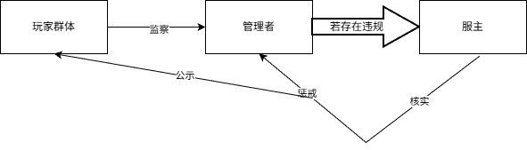
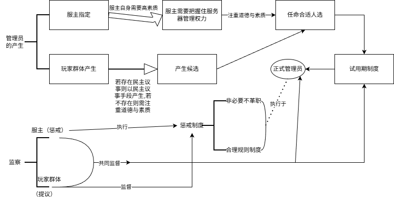

---
prev:
  text: '02.民主议事论'
  link: '/ServerOutlineOfTheTheoryOfHumanitiesGovernance/02-DemocraticDeliberation'
next:
  text: '04.人文规则论'
  link: '/ServerOutlineOfTheTheoryOfHumanitiesGovernance/04-HumanitiesRules'
---
## 03.管理层体制论
### 引言
根据之前的论述,我们知道管理者拥有极高的权力,那么这种权力是从何而来?目前主要有两种说法,一种是认为管理层的权力实际上是其在获得服务器硬件等物质资源的同时就获得的,从而认为管理者对服务器有绝对的控制权,服务器的生死存亡取决于管理者,管理者至高无上,也就认为民主议事制度下玩家的议事权和提议权就是管理层的"恩赐",而另一种则认为管理层的权力实际上是玩家为了能够保证自身可以游玩服务器的利益而被迫做出的让步,尽管玩家确实可以一定程度上影响服务器的生死存亡,但是由于其无法真正控制服务器硬件,再加上可能自身确实技术不足,领导力也薄弱等问题,其必须容忍管理者的存在,允许其获得这种至高无上的权力,从而保障服务器的运行,满足自身游玩服务器的利益.

### 权力来源论
实际上,这些说法都是片面的,他们都说对了一些,但又不完全对.管理者这种至高无上的权力一方面确实是取决于其对服务器的物理控制,因为其也付出了一定成本,其固然要有在服务器内的这种至高无上的权力来补偿自己,但是在另一方面,对于对外开放的服务器(本论纲所讨论的这种),其生命在于玩家群体,管理者的权力再大也是针对于服务器自身的,其无法彻底控制玩家,因而其必须做出让步并考虑玩家的想法,而玩家群体因为自身可能存在一定的技术条件不足等问题,其也必须让步允许管理者的管理,双方共同让步,最终就形成了多力量中心制衡格局:管理者确实有至高无上的权力,但是只针对于服务器自身,而玩家群体随时都有"掀桌子"的权力,故而双方保持了一定程度上的力量对等,相互制衡.

这就是管理者至高无上权力的来源和其"明明至高无上,却受到限制"的原因.

### 服主及管理层体制
那么,我们已经知道了管理者的权力来源,但是管理者是个很笼统的概念,一个服务器可能有一个管理者,也有可能会有多个管理者,其中服主也算作是一个管理者.服主不一定是物理服务器的实际掌握者,而一定是服务器最高的象征的领袖,一般情况下,服主是服务器的所有者(硬件和法律意义上的所有),治理者(最高决策与管理)和象征性领袖(这决定谁是最终的真正的服主,其更替代表着真正的实际意义上的服主的更替).

那么管理层都有什么样的组织形式呢?主要有以下几种(也可能存在其他形式,此处不一一列举):

①单一服主:这种服务器只有一个管理者,也就是服主自身,没有任何管理员,一切有关管理者的内容实际上都是其一个人独自处理,其优点在于只要服主自身素质较高即可优秀地完成各项工作,但如果服主自身能力低下,服务器也很容易因为这种服主的"单一独断"而消亡,且管理层事务较多,服主一个人可能无法处理好所有事物.

②单一服主与单一管理员制度:这种服务器有一个服主和一个管理员,一般情况下两人共同管理事物,但是也有些场景中,服主或管理员主要不干什么大事,而将其交由另外一个人,现实中往往是服主自身能力不足,从而选了一个个人素质强悍的管理员来辅佐其维护服务器运行.

③多管理员制度:同前两种一样,也是一种比较常见的形式,管理层有多个管理员负责管理事务,其优点在于多人管理效率可能会提高,且能优势互补,缺点也在于多人管理可能会导致"公说公有理,婆说婆有理,那该听谁的?"这样的问题,且一个管理员出差错也有可能会损坏整个管理者团队的形象.

④服主被架空:这是一种特殊形式,也就是服主实际上只是在负责维护服务器存在(当然,也存在服主没能在物理意义上控制服务器的情况,此时可视作服主的所有权方面被架空),而实际上已被架空(治理权方面被架空),真正的大权早已放至管理员团队,如果服务器的象征性领袖发生实质的变化,那么也就可以看作是服主的变更(仅适用于一般情况,需要具体分析,但是如果一个服主只剩下了象征性领袖的意义,那么确实是如此).

⑤服主独断:这也是一种特殊形式,区别于单一服主,这种情况下一般存在其他管理员,但是其只是"傀儡",往往存在于特权化管理的服务器中,实际上是服主说了算,管理者团队在这种情况下很有可能是服主用以维护其特权化管理的工具.

### 管理员的产生
那么管理层组织形式说完了,可能我们会想问:那管理员哪来的呢?怎么选更合理一些?

实际上这也要根据服务器具体情况考虑,目前主要是两种选举形式(也可能存在其他形式),一种是服主直接任命管理员,另一种是管理员由玩家群体中产生.

一般来说,服主直接任命管理员是基于双方关系较为亲近的环境下,服主本身也更清楚任命的管理员的个人情况,常用于新人刚开服务器,需要管理员但是要么没多少玩家,要么就选不出能担此重任的人,或是规模较小的服务器,对管理员数量要求较低,或是受限于服务器实际情况,服主本身极其不信任其他玩家,从而选举熟悉的人作为管理者.

直接选举的优势在于可控,且服主一般很清楚管理者的情况,但这也是其缺点,因为服主有可能就此逐渐走上了特权化管理的路,和管理者团队共同维护自身特权化利益,且受限于这种熟人关系,对于管理者的惩戒可能也不能很好落行,从而给玩家群体留下一个"服主和管理相勾结欺压玩家"的不利形象.

管理员由玩家群体产生一般是通过选举或者推荐,或是考核等普选形式,主要应用于存在民主议事体系的服务器中,当然如考核等特殊形式,也可能不需要民主议事.其优势在于出自玩家,但也有一定的局限性,如考核一定程度上可以确保其技术条件等,但是有可能无法控制其道德水准.选举或推荐出的管理者可能有道德但是没什么技术,甚至有可能受于玩家团体化影响,一个玩家团体推举了一个傀儡管理者,用以维护玩家团体自身的利益.

总之,我们只能根据实际情况,选择实际的方案,利用创新思维,积极创新管理层相关体系,善用超前思维,正确预测未来趋势,提前做好准备,常用发散思维,从不同角度分析问题,协调各方,从实际出发,设置合理的制度,打破常规思维框架的限制.

### 管理层体制的局限
此外,管理层体制有其固有的局限性:

①在上文,我们提到有些管理者可能并不能做到"一个人当六边形战士",样样精通,毕竟人无完人,从而大多数多管理员的体制普遍都实行管理员优势互补,比如善于和玩家沟通,道德水平高的去处理玩家间问题,技术高超的去维护服务器,思维能力强的去负责创新服务器体制或玩法等.但是这又导致各管理员之间的协调问题,玩家一开始可能并不知道有这么细致的划分,导致"找错人",各管理员如果需要协调工作,也会耽误一定的时间,影响效率,如果职权划分不清,可能会导致一个领域被一堆人管,从而都管不好.此外,一些管理者的偏好伪装可能会产生相关问题,比如"善于沟通者"反而是精致的利己主义者,对于技术方面更为明显,技术能力的验证成本很高,如何验证其技术高超?这有需要相关审核与考察实践机制(比如多场景验证:将候选人置于冲突调解,技术故障处理等不同情境中观察,细节调查:调查该玩家的历史行为记录,渐进授权:从有限权限开始,根据实际表现逐步扩大职权,但也需要根据实际情况考量).这都是这种管理层体制所固有的局限性.

②如果管理员人数极少(比如不高于3个),但是其都是"六边形战士",这就又会导致大量工作都堆积到这些人身上,人的效率是有极限的,不可能做到任何事物都处理的完美,可能会导致"管理员累死",但实际上各种现象也没有得到明显改善的问题.

③不论管理员人数,其综合起来来看总有一点或多点无法处理(比如所有人都不理解插件相关问题),导致相关问题难以处理.

④公益性问题,大多数服务器是公益服务器,管理员纯粹是"为爱发电",但如果其遭遇了一些现实打击,比如恶意玩家的攻击或者其他实际生活的问题,其很容易失去热忱,离开管理者团队.如果公益服务器需要花钱来招相关的管理员,这又是一笔支出.如果是非公益服务器,就要考虑到管理员是否有相应的收入,如果也是"为爱发电",也容易导致上述问题,如果是有报酬的,那就又要严格监察,防止"拿钱不干事".此外,公益服务器中管理员可能因缺乏物质回报而寻求特权补偿,这实际上构成隐性腐败,管理员的声誉积累可能成为脱离玩家群体的资本或成为"谈资论辈"的工具,这也是一种固有的局限性.

⑤其他综合性问题,比如由于管理者普遍是一个团队,玩家群体对其的初印象也是以群体不论个体,一个人可能会拖累整个群体的形象,或者是各种综合来看的全局协调问题等,均是其固有的局限性.
这些局限性很难被人为消除,这又取决于现实的服务器管理中大家基本都是在网络对话,任何一个人"掀桌子"的成本都是极低的,但是造成的代价又是极大的.且管理者的主观思想对其管理确实有极大的影响,我们只能通过各种制度手段等尽力弥补这些局限性(这就又需要具体问题具体分析,不存在通解,只能根据服务器实际情况设计适合的方案),而不能将其彻底消除.

### 从民主议事到管理层体制
那么,之前我们在民主议事论中谈论了民主议事制度相关内容,如果一个服务器确实存在这种民主议事制度,那么民主议事权力和管理层权力会有冲突吗?显然是会有的.一般来说,如果不存在民主议事制度,那么管理层权力就是"一家独大"的,但如果确实存在一套被正常践行的民主议事制度,其与管理层权力又会产生一定冲突.

民主议事权力实质上是管理层对玩家的一种妥协,双方都要放弃一部分最优解来换取整体的平衡.例如一个服务器的硬件资源实际上并不充足,玩家群体希望在服务器建造一些大型生电机器,这会导致服务器卡顿,从而影响服务器长久的发展,故而双方都需要做出一定的妥协,玩家需要放弃一定的机器的效率,管理者也需要付出一定的代价去允许玩家的游玩行为,才能更好满足双方的部分利益.除了玩法内容上的矛盾,也可以是民主决议要求封禁某管理员而管理层拒绝执行,紧急危机时刻民主程序与管理效率的矛盾等.显然,双方都没有达到其满意的最优解,那么其就会产生一定的冲突.对于玩家群体和管理者群体,其对于自身权力都有一种天然的追求,都希望自身权力不能"久居人下",用自身的权力保障自身的完整权利,但是又受制于多力量中心制衡的格局,一旦一方失衡,服务器的管玩矛盾很快就会激化,从而走向消亡.因此这种双方都各自多想一步,都各自多退一步的做法才能在无尽的争端中求同,共同促进服务器发展.

上述只是理想情况,实际的情况更有可能是民主议事权力和管理层权力的直接较量.这体现为双方各自"瞧不起"对方,都想将其消灭,民主议事制度需要管理者做出足够的让步,但如果管理者确实无法做出足够的让步,但又固执地去试图建立民主议事制度,那么下场就是陷入无尽的争斗,从而导致服务器的消亡.

一般来说,玩家群体的民主议事权力和管理者权力冲突的根源在于根本利益的冲突,这是不可避免的,但是其烈度一般并不足以快速激化管玩矛盾,大多数情况下管玩矛盾激化取自于管理层权力自身的腐败,滥用等问题.而玩家群体的民主议事权力也有可能存在滥用,因此一种合适的监察体系就显得尤为重要.
### 监察困境:不对等性
说到监察,我们一般认为玩家对管理层的监察很重要,毕竟很多服务器消亡的案例都出自管理层的不作为或者乱作为.但实际情况远比我们想象的要更为复杂.

首先,自下而上的监察实际上很难简单而直接地保证其有效,大多数人认为,玩家监察管理者,然后再举报给服主不就行了.其认为监察体系如下图一样简单:

但实际上并非如此,如果服主和管理员是一种熟人关系,其可能无法做出有实际效果的惩戒,甚至有可能"一不小心"就把举报者抓出来了,甚至如果服主本身就和管理者是一伙的,或者服主被架空了,那好的结果是举报"石沉大海",坏的结果是该玩家直接被制裁了.

实际上,由于管理层有至高无上的权力,甚至如果存在并不惧怕服务器的消亡的管理者个体(比如存在"反正服务器不是我的,没了就没了呗"的想法),那么任何监察体系和民主议事体系都不成立,因为这无法动摇管理层的至高无上的权力,除非有实权的服主直接宣布取消其管理员权力.

其次,就算监察体系真正能够建立,那又有谁能够惩戒管理员?如果是玩家群体,那玩家群体又能给出怎样实际的手段呢?显然,玩家群体最多只能提议,并没有办法真正做到直接惩戒管理员,那么我们就要在管理者团队内设置一个惩戒管理员的管理员吗?显然,这更不合理,这样管理者内部的矛盾就更大了,例如"凭什么你说了算"等问题,况且又该怎么监察这个惩戒他人的管理员呢?这也更不利于服务器的长久发展.显然,最后只能给到服主,让服主去对管理员采取强制手段.

对于大部分中小型服务器,监察体系实际上难以建立,尤其是自下而上的监察,毕竟现在处于互联网时代,我们没有办法做到像现实中那样的监察,因为互联网时代我们很难"隔着屏幕强制执行",这也是一种管理层固有的局限性,也就是其权力大,但是却难以真正有效的被监督,更难以受到真正的惩戒.

实际上大部分服务器的监察体系都是不存在或者不成体系的,一些超大型服务器(特指有运营团队的大型服务器且能够构成稳定资金收入的,其存在全职运营团队与商业化运作),除了一些核心人物外,大多数管理员普遍都是通过考核进入的,玩家也能以各种手段去监督管理员,比如通过官网的举报等等.这是因为这种管理员实际上权力是严格受到更高一级的管理者的限制的,其只是介于玩家群体和高级管理者之间,负责办事,显然对于其他大多数服务器,没有办法去执行这样的制度,根本不存在这样的物质条件基础,这样的服务器也脱离了本论纲的讨论范围,因为其往往拥有较为成熟的商业化的人文治理体系.

难道管理者就手眼通天吗?目前来看,如果服主没有什么权力,管理者自身也是不在乎一切,那其确实是手眼通天的.因此,要建立一套监察体系,我们就先得选出来合适的管理员,然后才能对其进行监察,这也是服务器治理中最特殊的体系,是先有合适的人,然后才能有合适的制度去监督这个人.否则,大多数监察体系就只能是空谈.

### 管理员的任用
那又怎么选出合适的管理员呢?首先就是服主自身要牢牢把握住管理服务器的权力,服主自身必须有极高的素质,以便必要时刻服主亲自管理.其次就是"重视玩家"这一原则,如果存在民主议事体系我们可以借助其选举玩家支持的管理者,如果不存在,服主也应当在选举管理者时尽可能全面分析.

目前最好的办法是使用试用期制度,也就是新的管理员在刚接任时必须接受玩家的监督,其在执行某些重大决议时(尤其是可能干涉玩家利益的),也必须接受玩家和服主的双重监督,如果其实在不适合管理,则直接撤销其管理资格.

此外我们也要在选举管理员时重视管理员的个人道德素质,至少其应该真正的敢于接受玩家的建议或批评,为自己做的事担责.

如果确实无法选举,服务器的实际情况决定服主必须亲自指定,服主也应当牢记以上原则,对于有其熟人关系的管理员,必须在必要时刻放弃这种熟人关系,不能让所谓的感情破坏了原则,牢记"数量不重要但是质量重要"的这一重大原则.

对于管理员的实际违规行为的惩戒,则需要提前设置一个合理的规则制度,但是对于管理员来说,由于其数量一般较少,除非涉及到极为严重的违规行为(或是玩家群体对此极其不能容忍),否则不应撤其管理职位,而是采用其他手段,这就要求服务器有一个合理的人文规则.一般来说,应有警告,降级,暂停权限等渐进措施,且如果玩家议事结果合理应该考虑玩家建议.至于具体违规程度判定者,一般为服主和玩家议事决议(若存在)或相关玩家等,但一切应当以实际情况为基础.
### 监察体系
因此,最终的自下而上的监察体系的流程图应该如下:

值得注意的是,如果不存在民主议事,那么玩家方面的候选人可以通过其他合理手段如自荐,考核等选拔,但其一定是要符合服务器实际情况的.而管理员被惩戒后也有权利申诉,例如在玩家代表会议(若存在)或服主处以足够的证据自证(须在服务器人文规则方面设置相关体系),若存在误判,则应取消原有惩戒,公开反思.

其次,自上而下的监察一样重要,毕竟玩家群体也有可能会做出一定的违规行为,而这种自上而下的监察,更离不开一套合理的人文规则,由于本章主要涉及管理层自身,故不在本章论述.

那么我们上文又提到了要利用服主的力量,又反复提及了如果存在玩家议事制度,也应当利用其来帮助我们选取管理员,重视管理员自身的道德,然后对其加以监察.那么这会不会又导致权力关系过乱?这取决于管理员到底是一个什么身份.

一般来说,如果我们将管理员和服主同等看待,那服主实际上就是一个有权选举其他管理员的最高管理员,并且我们对其要求较高,如果存在民主议事制度,对其的监督也需要更加严苛.如果不认为管理员和服主是同等地位而认为管理员介于服主和玩家之间,是服主下派,用以维护服务器正常运行的一种手段,此时,如果服主享有极高的权力,就又容易造成服主独断.这实际上也是管理层体制固有的一种缺陷,管理员和服主的关系极为复杂,我们很难真正区分两者在实际管理中的作用,具体的来看,如果服主确实掌握了服务器最高的控制权力,而不是被架空,那么管理员职权范围要小于服主.此时也就更需要服主严于自我监察.

管理层体制论最大的局限性也在于此,也就是玩家无论如何都没有办法真正做到自下而上的监察所有管理层人员,从而导致自查必须在监察体系中占有一部分比例(甚至可能是很大一部分比例),而自查又要对管理者有极高的个人素质要求.
### 实践案例:分权专事制度
也有一种理想制度形式是分权专事制,即服主自身保持较高素质同时,各管理员只针对于其具体职权范围有相关权力,不享有其他任何权力,从而确保单个管理员不会将过多的权力揽到自身,但这也需要我们克服一些协调工作的困难,例如技术问题和玩法问题冲突的最终裁决,实际上应该具体问题提具体分析,一般来说,服主有权保持在紧急情况下的权力收回,但也需要正当理由.无论如何处理,一切都应当以事实为依据,故本论纲不过多涉及实际方法的指导.
### 监察:具体问题具体分析
无论如何,自下而上的监察还是要确保玩家敢于监察,也就是营造一种良好的风气,让玩家看见管理者有违规行为时敢于举报,善于举报,让管理员提高自身道德素质,尽可能做到不违规和办好事,同时服主必须有一定的个人素质,用以承接大部分工作的协调以及最终裁决惩戒.

对于被从玩家群体中选举成为管理员的"玩家"来看,其也应该将自身原有的玩家视角下的"寻找有利于其发展机会"的利益转变为管理者的"维护服务器长期发展"的利益,否则,其依然保持着一个玩家的身份,就有可能借用管理员权力来满足私欲,也有可能受到玩家团体化的影响,为玩家团体利益服务.对于这种情况,其首要任务就是明确管理员身份的特殊性,与原有玩家团体切割,这也需要其做好心理准备,因此我们的管理员设置也不应当是完全强制的,也要考虑实际情况.

而对于所有管理员,由于玩家团体化,实际进行部分决议时可能会受到不同玩家团体的阻挠.故玩家团体化也是其管理层体制必须应对的一个难题.

对于技术管理员,由于其性质特殊,其应当与传统管理员区分开,大部分内容保持一致,但是相关技术部分要单独处理,防止破坏工作效率.对于设计玩家核心利益的技术问题,应当保持民主议事(若存在),其技术权力在这种情况下受制约,而"维护服务器安全","修复玩法漏洞"等则不应被过分限制,但也需要做出对玩家群体的反馈.此外,玩家群体中不了解技术的较多,相关监察较为薄弱,一方面需要服主加紧监督,另一方面也需要相关负责人员将修改内容以更加平常化,玩家能够看懂的方式表达出来.

### 总结
那么,我们又说民主议事又说管理体制,到底先有谁(若存在民主议事)?实际上,不存在绝对的先后顺序,可以是先有了民主议事,然后有了更多服务器管理员,也可以是管理员组织着民主议事,无论如何,最开始一定先存在服主,然后再出现民主议事或者管理体制,这取决于服务器的实际情况.类似于"宪法制定者是否受宪法约束"的难题,不过我们不必讨论这类难题,先后顺序也无法真正改变多力量中心制衡的基础格局,我们要做的是求同存异,一切从实际出发,建设合理的管理体制,以达到最佳的服务器管理效果.

同时,对于服主(有服主的相关性质的,如是服务器的所有者等,满足一定的条件)的高素质要求,也体现着服务器自身的固有局限,由于服务器的一切最终都能被有实权的服主控制,且有实权的服主是唯一能依靠更强的力量压制常规管理者的存在,综合来看,服主最好就要确保自己有高的素质,因此很多常规管理层体制架构都要依靠服主.当然,服主也并不是一定要当"六边形战士",只要能够做到在具体的需要服主这一强制力量的领域"发挥用处",符合服务器实际情况即可,这就又体现了符合实际情况的重要性.

管理层向上对接玩家群体,向下统筹着服务器自身和游戏实际内容,只有管理层运行稳定,其才能统筹玩家民主议事制度,并统领游戏玩法,缓解管玩矛盾,促进服务器的长期发展.无论什么样的管理层体制,其都不是"绝对坏"或"绝对好"的,只有最符合服务器实际情况的,才能是合理的服务器管理层体制,一定要牢记"具体问题具体分析"和"一切从实际出发,实事求是"的观念.