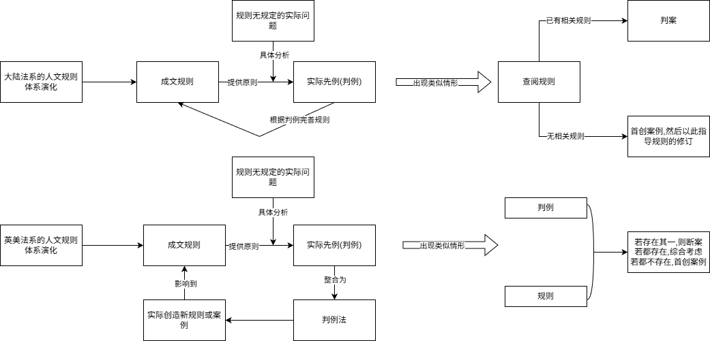

---
prev:
  text: '03.管理层体制论'
  link: '/ServerOutlineOfTheTheoryOfHumanitiesGovernance/03-ManagementSystem'
next:
  text: '05.管玩矛盾论'
  link: '/ServerOutlineOfTheTheoryOfHumanitiesGovernance/05-AdminPlayerStructuralContradiction'
---
## 04.人文规则论
### 引言
根据上文,我们得知一个合理的有用的管用的人文规则是至关重要的,我们可以根据这些人文规则去践行某些制度体系,维护玩家群体整体利益,更好地维护服务器的长期发展.那么规则是从哪来的?凭什么又是这样的规则?

就像现实人类社会,一开始在原始社会有了原始习惯和戒律,随着生产力与社会经济的发展,私有制和阶级的产生以及国家的出现,这就产生了法律,在现实中,法是一个历史范畴,它是为了维护统治阶级利益而产生的,是统治阶级意志的体现,而马克思主义认为,法律随着阶级和国家的消失,法律也要逐步走向消亡.

服务器的人文规则也是一样的,从大体上来讲,一开始也是只有玩家们的习惯约束,后来为了维护服务器秩序,在玩家群体和管理者的共同作用下,逐渐演化出一套被普遍认可的基本规则,就完成了从习惯到明文的质变,最终,各个服务器再根据自身实际情况对其进行发展完善,形成了各式各样的人文规则.

一般来说,这些规则是为了满足管理者的利益,如果管理者是为了特权化管理,那么这些规则就有很明显的特征(主要就是以各种手段维护管理者至高无上的地位),而如果管理者是为了促进服务器的长期发展,由于玩家群体是对外开放的服务器的生命源泉,导致这些规则虽然也是管理者意志的体现,但是其却也可以一定程度上维护玩家群体的利益(其与玩家群体的共同利益有一定的关联),这也可以看作是一种妥协与让步,一定程度上也算是缓解管玩矛盾的尝试.

### 游戏的"规则"
那么都有什么样的规则呢?我们不妨先从最简单的说起,也就是"游戏内容的规则".

游戏内容的规则可以看作是游戏实际内容力量具象化的一种形式,其也是负责维护多力量中心制衡的格局的存在.这一定程度上也会影响服务器的玩法,目前来看我们要从两方面去讨论.

一方面就是真正意义上的"有没有规则",这决定着这个服务器是个什么样的性质.例如大名鼎鼎的2b2t就是无规则服务器的典例,我们可以说这种无规则服务器的最大的规则就是没有任何规则,这也确实为其发展创造了巨大的贡献,不过如果彻底无规则的话,人文规则的讨论也就失去了意义,所以本章中我们不过多论述这种服务器.

此外,还有一种伪无规则服务器,名义上是学习2b2t那样无规则,但实际上可能会做出一些非极端化的限制(比如禁止卡服崩服,甚至于开挂),这种服务器本质上是为了以无规则的名号吸引玩家,但是又局限于服务器自身情况如硬件设施等,不支持玩家过度无规则,因而做出了一种限制.

大多数服务器都是有规则的,这些规则往往是围绕服务器玩法和维护服务器运行而编写的,在这过程中,其不免会和玩家群体的利益产生一定的联系.

另一方面就是游戏实际内容意义上的规则,这一定程度上也影响服务器的玩法,但是很有限,对于大多数服务器来讲,其最大的影响可能就是在于"有没有死亡不掉落"这一区分,至于其他的游戏实际内容意义上的规则,大多数情况下都是根据服务器具体情况调整的,这取决于服务器玩法自身,故本章也不过多讨论这样的规则.

### 人文规则的应然原则
人文规则毕竟重在"人文"方面,我们主要讨论的是玩家守则,管理员守则,惩戒条例,监察体系,执行体系与申诉体系这五大内容(在本章,我们着重讨论规则的设计原则等问题,而不是规则的执行等其他问题).

无论是什么规则,不管涉及哪个方面,其都需要根据实际情况来决定,但是至少有一些通用条例是适用于所有规则的,包括但不限于如下:

①禁止任何意义上的人身攻击或是其他影响到现实生活的内容.游戏是游戏,现实是现实,我们不能因为游戏内的纠纷,就干涉到他人现实中的生活,如果确实存在有影响现实生活的内容(包括但不限于"开盒"之类的非法获取他人隐私信息,造谣,污蔑,网络暴力,威胁等),我们也要坚决以法律手段维权.

②禁止攻击服务器.显然,如果把服务器打崩了(比如网络攻击等),那一切就都没了,尽管这条规则只是防君子不防小人,但是这也是我们一定程度上用以维权的依据.

③一般来说,无论我们整个服务器群体说什么做什么(包括玩家群体和管理者团队等涉及服务器的所有有关成员),都不应当涉及到现实中违法或者敏感的内容.比如涉及任何国家的主权,领土完整内容,那么如涉政黄赌毒黑等违法内容,就应当严令禁止,无论以任何方式,且有意暗示的应该加重处罚.

也有可能会存在其他的通用准则,但这三条一定是任何规则都需要有的大前提.因此在后文中我们也不会再次重复这一部分内容.

除了上述大前提,我们还需要考虑人文规则的原则性问题,这些原则应当贯穿于人文规则,作为人文规则的最大指导方针与目的意图指向,一般来说需要有以下基本原则:

①公序良俗原则(公共秩序与善良风俗).尽管在大前提中我们规定不得违法,但实际上法律只是道德的底线,在一些情况下我们的规则需要起到道德的约束作用.例如所有人都有权发言,但是不应当发布极端的违反基本道德的内容.

②平等原则.除非存在特殊的正当原因(如已确认一个人的不当发言造成了极其恶劣的影响,但不至于彻底踢出服务器,根据规定剥夺了其在游戏中的一定时间内的发言权,此时可以看作存在特殊正当原因),所有人应当地位平等,不得因某事由而被歧视.本原则也需要对管理者产生约束力,管理者在制订规则时,也需要遵守规则,不应为自身的不当行为设置免责事由,更不应因自己的特殊身份就高人一等,无视规则.

③自愿原则.即尊重所有人的自主选择权,例如玩家有退出服务器的权利,管理者有辞职的权利,总之,要充分尊重每个人的合理意愿.

④公平原则.例如权利义务需要公平配给,例如管理者不应当有监督违规行为的权利而没有接受监督的义务,或不能无故或因不当不合理事由就给予任何人特殊优待或特别歧视.

⑤诚信原则.在各领域遵守诚实信用的原则和指导方针.

我们并未对上述原则并未做出过于明确的分析说明,由于其作为人文规则的精神支柱,其一般是设置人文规则时要考虑的原则性问题并作为执行人文规则或触及到人文规则未涉及内容时应当遵守的判断原则(部分人文规则可能会存在其他指导原则,但需根据实际情况具体分析).有了这些原则的人文规则才能具有更强的说服力,得到所有人的认可,而不会沦为一纸空文.我们的人文规则需要有约束力,发挥维护公共秩序的作用,但其更需要被认可,被执行.

由于各个服务器具体实际情况不同,其规则也必然不同,只要这个规则确实适合服务器的具体情况,并且确实能够做到权衡各方,既维护玩家群体整体利益,又能促进服务器长期发展,那就是好规则.因此本论纲中主要探讨的不是实际规则内容,而是怎么去设计一个合理的人文规则.

### 规则:对玩家的要求
那么,我们不妨看看对于玩家的规则:

①除非情况特殊,否则一般情况下应当不允许玩家实行任何的作弊行为,包括但不限于矿透,杀戮光环等.但是有一些情况一些服务器可能会允许部分"作弊"行为,例如虽然矿透可能会对整个服务器的经济系统造成严重的影响,但如果这个服务器是生电与建筑服务器,根本不存在所谓的经济系统,到后期机器效率开起来也不缺这点东西,那么前期其可能会允许玩家使用矿透来加速发展,这是受服务器自身实际玩法以及玩家群体利益而定的,其根本目的是为了保障玩家快速发展,快速进入主题,那么这种情况矿透就可以不算作是作弊行为.

②一般来说,我们在保障玩家群体利益的同时,也要兼顾玩家个体的利益.保障玩家个体权益,最基础的就在于玩家私有财产不受侵犯.尤其是生存这类玩法的服务器,因此大多数玩家规则也都存在如禁止偷窃他人财务等规则,但实际上只是防君子不防小人,因为玩家在游戏中违规的成本过低,付出的代价也很难真正成正比,还是需要更加强而有力的措施(比如领地插件)来辅佐该规则,但是也要存在相应的保障玩家私有财产不受侵犯的规则.这种私有财产是各种意义上的,比如玩家自身的物品,玩家的建筑,建造的红石机器等.

③如果服务器不是以战争为主,一般情况下应当禁止抢劫,禁止玩家恶意PVP杀死其他玩家来抢夺物品(如果存在死亡掉落)或是恶意PVP来毁坏其他玩家的游戏体验(如堵出生点).否则不是战争主题的服务器也要变成战争主题的服务器.

④一般来说,确实我们要保证私有财产不受侵犯,但如果该玩家的个人利益不合理(他的个人利益可能会损害更多人的合理个人利益),例如刷屏或者建造大量无意义建筑,那么也应当对其做出限制,我们要牢记在群体利益面前,个体利益应当作出一定让步.

⑤禁止发布任何意义的广告,尤其是宣传其他服务器.如果是与服务器主题不相关的其他广告比如某些软件或网站等,那也会干扰其他玩家的交流,如果是宣传其他服务器那更会干扰本服务器的发展进程.实质上是要禁止玩家发布任何可能会损害服务器利益的内容.

⑥禁止散布谣言或辱骂他人.显然,这些不当言论会阻挠其他玩家或服务器的发展.

⑦禁止滥用服务器相关功能.实质上是要禁止玩家不当利用服务器功能损害了他人权益,比如恶意利用领地插件,将一些重要的公共设施据为己有,那这就是损害他人权益的.

⑧禁止骚扰其他玩家.同理,游戏是游戏,现实是现实,不能将游戏行为上升至现实.包括但不限于在群聊中添加一位玩家的好友之后疯狂给他发消息或者干涉其日常生活,恶意散发令他人不适的言论等.当然,在游戏内也同理,也不得在游戏内以任何方式去影响其他玩家的合理游玩.

⑨禁止恶意曲解.例如我们设置了具体规定,新人刚进来没理解是什么意思,那么这些恶意曲解就可能会让新人产生对规定的理解错误,甚至直接违反规定,更有可能直接劝退新人.因此,管理者也要加强自身逻辑学知识的学习,并加强监督巡视.

⑩禁止以任何形式影响服务器整体运行.包括但不限于莫名其妙繁殖大量生物等行为,或是恶意利用卡服漏洞等,这会干涉所有人的游玩权益,且任何人不能以"反正服务器都没几个玩家了,你管我干什么"之类的理由转移话题.

以上是基本的玩家守则,我们设计玩家守则,目的就在于平衡玩家个体,玩家群体,服务器综合发展三者.因此,我们对于玩家的规则设计也应当是站在玩家的角度去想有哪些问题可能会损害其个人利益,站在玩家群体的角度去想有哪些问题可能会影响玩家群体的发展,再站在服务器综合发展的角度来看,怎么才能让服务器更长久,从而综合设定规则,而不是生搬乱套,将其他服务器的规则盲目强加于自己服务器.大多数规则实际上并不是从玩法上限制玩家,而是要从道德上限制玩家,因此,我们要尽可能利用发散思维,设想一些在实际场景中可能会出现的问题,通过演绎推理模拟,从而提前设计相关规则以防管理时无规则照应的情况.

### 规则的明确性要求
而对于这些规则的表述,我们应当使其尽可能简短而准确,不存在语病,不存在脏话,将规则和案例合编,形成一种"基本规则-阐释-判罚标准-案例"的体系.

例如,对于禁止辱骂他人,我们可以这么写(这样的编写原则也适用于所有人文规则条目,此处仅做简单演示):

禁止辱骂他人.任何玩家不能在服务器聊天或群聊中侮辱谩骂他人,也不能通过建筑告示牌等暗示方式对他人进行辱骂或诋毁,若问题影响不大的,禁言一天,若对该玩家产生巨大影响的,考虑永久禁言或踢出服务器,若对公共秩序产生重大影响的,直接踢出服务器.

案例:一玩家对他人进行辱骂,持续一周内均有此现象,对该玩家造成了极大影响,经决定,将其踢出服务器.

实际上,我们不一定要完全展示规则的所有部分,可以根据实际情况,将不重要的部分折叠起来,灵活地展示人文规则.
### 规则:对管理员的限制
那么,对于管理员守则,我们又该怎么设计呢?一般来说,管理员无论是否参与到了服务器游玩,其也必须严格遵守玩家守则.此外,其应当遵循以下基本原则:

①论事不论人.实质上是为了防止管理员以惩戒为由对玩家个人实际生活造成严重影响.管理员确实有权处置违规玩家,但若其产生了对玩家现实中人身权益的非法侵害,我们应当考虑严肃处理该管理员.

②积极办事.实质上是为了防止管理员效率低下,办事推诿.除非其确实无法处理相关事项或超出其权限范畴,一般来讲,管理员应当积极办事.

③积极巡查.实质上是为了发挥管理员作用,尽可能通过巡查的方式减少违规者对玩家实际游玩的影响,将其扼杀在摇篮.

④判罚有理,接受监督.管理员对违规者的判罚应当是符合规定的,接受监督指的是其必须接受玩家群体和服主的监督,比如在实行了对一个玩家的惩戒后,汇报情况,具体说明事情缘由,保障玩家群体的知情权.

⑤公正无私,不受非常干扰.管理员必须是公正无私的,不得包庇他人,其也不能受到玩家团体的影响就不实行惩戒(例如某个玩家小团体威胁其如果其敢对某个成员进行惩戒就攻击管理者),如果确实遇到相关情况应该交于服主和更多管理者共同处理,若情况严重,可考虑限制整个团体.

由于实际情况不同,各个服务器也应当根据其具体问题调整规则,任何管理员守则其实质就是要防止管理员滥用职权或不用职权,也就是不作为,乱作为的问题.我们要从这一理念出发去调整管理员守则.

### 规则:惩戒措施
对于惩戒条例,主要分为对玩家的惩戒和对管理员的惩戒:

①对于玩家的惩戒,一般情况下应当就事论事,如果是在交流群中的违规,就应当在交流群中对其进行惩戒,而不是在游戏内惩戒,因为其也有可能不怎么玩服务器.主要手段以禁言,踢出,公开批评等为主.如果是在服务器中的违规,则有更多手段,例如封禁,拘留(限制玩家行动),禁言,没收物品,强行使其赔偿(常用于损害他人权益)等,但任何惩戒都不应上升至现实生活.

②对于管理员的惩戒,若管理员自身数量极为稀少,我们一般采用非必要不革职的手段,但是一定要迫使其改正且意识到自身错误,并在一定时间内限制其权限,如警告,降级,暂停其管理权限等.

③惩戒必须有实际情况的前提.我们必须有足够的证据,才能对一个人实行惩戒,可考虑执行孤证不立等原则,但也要根据服务器实际情况具体分析.同时,我们应当保障违规者(或嫌疑者)进行自我辩护或申请他人为自己辩护的权利(主要是辩论是否算是违规或是否应当被如此惩戒的问题,以确保惩戒的公平性),这需要服务器存在相应的合理有效的制度,但是无论如何,其应当遵循人文规则的基本原则.

④惩戒力度必须按实际影响,主观恶意性,违规者态度综合考量,其中最重要的就是实际影响,其次是主观恶意性和违规者态度,实际影响方面应当考虑其对受害者造成的影响,若受害者是非自然人(如服务器等实体),就应当考虑其造成的损失,若受害者是自然人,就应当考虑受害者的口述,对于主观恶意性,一般情况下,不能轻易降级处罚力度,除非其确实不知晓实际规则且受害者不额外追究的,可以考虑稍微降级处罚力度,对于违规者态度,若其极其恶劣,可考虑上升惩罚力度,若其态度良好,也可考虑降低处罚力度.

⑤注重程序公正与无罪推定.惩戒过程必须是公正的,从举证到判罚,必须公正公开,若是举报,需要举报者进行论述并展示证据(若举报者需要匿名,则需指定他人代替其进行论述),证明证据合法性,若是巡查,则需巡查者展示证据并证明证据合法性.且全过程必须有相关规定,结果也必须严格遵守规定,若实际规则中未出现具体条例,但其确实造成了一定程度的损失,也应当据实际情况稍微下调一定的处罚力度,并加以完善规则.无罪推定是指所有人在被彻底判决前其都是无罪的,不能私自将其进行惩戒.

⑥惩戒的合理与适度原则.一般情况下,对于某个违规行为的惩戒力度不应过重或过轻(相对于其严重性),如果过轻,就会使违规行为在违规者(或潜在违规者)眼中变得近似无代价,此时规则就失去了其一大意义(规则也具有警示的意义),其更难以及时遏制违规行为,使得规则形同虚设,如果过重,一方面可能会抑制服务器活力(所有人都很害怕违规从而被惩戒,因此过分担心甚至于用沉默或退服等手段自保),另一方面也有可能会刺激违规者(即"破罐子破摔"效应,明知道惩戒严重,无论多严重都觉得"也就这样了",从而进一步作出更多违规行为),这都不利于服务器的发展.

⑦惩戒的人文情理考量.除了考量主观恶意等(如上文),对于惩戒行为自身我们还需要考虑其可能的影响(惩戒不是孤立事件,而更类似于具有长期影响力的公共信号).规则的权威不是来自于恐惧,而是信任,规则是需要被自愿遵守的,而非暴力威慑,这就需要惩戒具有"考虑到人性的复杂"的人文关怀,而非机械适用规则.如果说上文的主观恶意考量等是从违规者的角度分析该如何进行惩戒,那么本条则是从实际影响的角度分析该如何进行公众警示,例如惩戒过轻就不能起到警示作用,过重就会过度抑制玩家活力,更有可能激化管玩矛盾.这需要我们了解服务器的实际舆论情况,根据公众的反应,对惩戒进行合理微调(从大众的角度看待本次惩戒并预估其可能的影响走向,综合考量得出最优方案)并加以公示,也就是要明确什么实际情况适用什么惩戒方式,惩戒行为合理且有警示教育作用,即能说服大众又能维护服务器秩序,但也要需要注意本项原则在实际实施时不能被舆论所裹挟,至少其必须遵循人文规则的基本原则.

惩戒条例一般是极其严苛准确的,执行主体一般是管理者,在一些特殊情况也可交予民主议事会议(若存在或实际情况符合).

### 规则:多角度维护监察体系
对于监察,一般也需遵循以下原则:

①监察主体广泛与鼓励合理举报.一般来讲我们要发动所有玩家和管理者,共同监察违规行为,玩家和管理者都有权进行举报.一般来讲,举报流程应多样化,例如设置网站或者问卷等,举报应当合理,有实际有说服力的证据如图像等,违规嫌疑人确实违规并且举报内容自身严谨清晰.

②对于自下而上的监察,大部分内容请参考管理层体制论,由于自下而上监察的困难性,我们更推荐服主自身保持高素质,接受玩家的监察,设置管理员可能无法阻挠的途径比如设置服务器网站或者问卷等接受玩家举报,重视玩家对于管理员的举报.

③对于自上而下的监察,一方面如果具体情况符合,应当细化分出专门负责巡视的管理员,否则也应确保管理员的个人素质,其必须公正廉洁,不贪不腐,积极巡查,理性判事.

④监察应当针对于所有人,包括服主,这意味着整个管理层团队必须要有较高的素质才能确保自下而上的监察的运行,对于自下而上的监察,我们更推荐管理层依靠自身高素质进行自查,并善于听取玩家意见.

由于监察体系的特殊性,各个服务器也应当具体问题具体分析,此处只列出通用准则,实际上,监察体系的核心就是确保下能监察上,上也能监察下,而不是只有一方可以监察,另一方只能被监察.

### 规则:规则的有效性与合规性要求
对于执行体系与申诉机制,应当遵循以下原则:

①一般来说,规则的制订需要在服务器正式开服(如果要设计民主议事,应当在民主议事之前)之前就准备完毕,其应当是管理层对服务器具体情况做出的初步分析而凝聚的.在服务器发展过程中,该规则需要管理层不断修订,也需要听取玩家建议,尤其是在该规则确实出现范围不足或无法满足实际需要,甚至是规则自身存在漏洞时更需要我们进行积极的维护,若存在民主议事制度,更应该听取民主议事的综合意志.这也要求我们打破固有思维,培养发散思维,从原有的固化思维中跳脱,才能更好地促进规则创新与完善.

②对于规则,自身若其确实是严格符合情理的,其应该确保其不被废除(比如若玩家议事要废除不能辱骂他人这一规则,则应具体分析,并尽可能确保该规则不被废除).这也是管玩矛盾和多力量中心制衡格局的体现,管理者必须确保一些规则,尤其是原则性规则的落实,这又可能会和民主议事等产生一定的冲突,故需要我们正确平衡双方关系.

③对于执行,若不存在民主议事,则应当尽可能对玩家公开所有执行结果,并确保执行过程的公开透明,若存在民主议事,对于紧急问题的处置(极为严重且紧急,不可能在短时间内通过民主议事而做出决断的)则应当充分发挥管理员的能动作用,在事后向民主议事与玩家群体汇报,只有对于非紧急情况的(如已经确保控制了一个开挂玩家),才应当根据实际情况发挥民主意识和管理层共同的作用进行讨论决定.

④执行的主体应当是管理者,玩家或民主议事应当对其进行监察,而不是直接代替管理者进行惩戒,否则就可能会出现现实中"陶片放逐法"的问题(表面上确实是要发挥民主议事作用,防止干涉玩家发展和服务器正常运行,但是又受制于玩家团体化影响,再加上各种实际问题,导致最后可能演变为团体和个人斗争的工具,迫害无辜者或不当处置了一些问题),影响服务器长期运行.

⑤对于申诉,仍然需要确保多渠道原则,保障所有人的申诉权,例如一个人可能会被禁言,但其必须能通过问卷或者服务器官网举报申诉等方式来对不合理判决作出申诉,若确实存在误判等,应当撤销判罚并给予一定补偿,公开展示,引以为戒.

### 主观恶意考量:具体问题具体分析
此外,我们还需要考虑一些特殊情况,以应对可能的棘手问题.

在一些情况下可能会有"善意违规"的问题,也就是迫于某特殊事由或有正当道德理由而违背人文规则的情况.例如,一名恶意违规者发布了有不利舆论影响的违规内容,另一位善意违规者为了维护聊天秩序与舆论风气,出言制止,但其措辞不当,导致双方形成了实际意义上的对骂,进一步影响了公共秩序,但是那名善意违规者的本意是为了维护秩序.或是如服务器规定了同态复仇原则,一位玩家的家被炸了,其根据同态复仇原则去进行还击,但却不慎损毁了服务器公共设施,导致其他玩家权益受到损害.我们的人文规则又要如何处理这类问题?

对于这种问题,我们需要考量违规者的主观恶意.一般情况下,善意违规主要发生在正当防卫场景(对于其他场景实际上也适用,本处仅对正当防卫做举例说明),此时人文规则就需要有相应的对于正当防卫的特殊条款,如规定什么情况下的正当防卫属于合理回击,什么情况下就属于防卫过当甚至不构成正当防卫.同时,相关条款需要遵循主观恶意考量原则,若违规者确实出于好心或存在正当事由,应当根据实际情况对其进行表扬,然后再对产生的不利影响做出评估,进行适当的非惩戒性处罚(应当远低于常规处罚标准),若违规者并非善意或相关事项不适用于善意违规制度(如服务器已经规定了不能如何做,其仍违规的),根据主观过错与实际影响,令主要过错人正常承担责任,非善意违规人承担由其造成的不利后果,就事论事,赏罚分明.

此外,还有一种必须适用主观恶意考量原则的情况,也就是对"无规定皆可为"的评估(一般对私权利来说,无禁止即可为,对公权力来说,无授权即禁止).一般情况下,人文规则没有明文规定的,应当看作是不违规行为(对于非公权力),此时如若确实存在相关违规行为,但人文规则确实未规定,我们就需要适用人文规则的基本指导原则(如公序良俗等原则),此时也需要考量该违规人的主观恶意,若其明知可能会造成不利影响,且存在为自己谋取利益的主观意图,就可以对其进行适当惩戒,但不应过度,如做口头警告,撤销更改,恢复原状等,同时注意完善人文规则.在这种情况下,主要发挥作用的实际上是习惯法(即社区舆论中认为属于违规或不违规作为判决依据),而对于所有无明文规定但可能违背某正当人文规则原则的行为,都需要遵循主观恶意考量原则,更需要具体问题具体分析,从多角度(如对其他玩家的影响,对人文规则权威的破坏等)进行分析.

### 发散与联想:从维护到演化体系
从上述两个特殊情况可以看出,我们的人文规则大多数情况下是不完善的,必须要不断更新维护,那么我们如何去进行更新维护,设置新的规定?一般来说,人文规则的完善主要有两种不同方案,类似于现实中的大陆法系与英美法系,我们将其称为人文规则体系演化(此处的大陆法系与英美法系只是与现实原则等内容存在近似点,而不完全等于现实中的内容).

大陆法系的人文规则体系演化,实际上就是一个发现问题,设立新规范,从而再适用的过程.实际判例只能作为参考作用,用于辅助管理层更新人文规则(强调裁判者只能援用成文规则中的规定来处理事件,裁判者对规则的解释也需受规则本身的严格限制,故裁判者只能适用规则而不能创造新规则),实际上就是在实际问题中不断完善规则,从而解决发生类似问题却无规则可用的困境,其优点是"一切皆按规则走",缺点是不够灵活,新规则一般只适用于新的具体情况,对于其他情况的指导有限.

英美法系的人文规则体系演化,实际上就是"遵循判例"的原则.实际判例(判例法)有很大的指导意义(裁判者既可以援用成文规则也可以援用已有的判例来处理事件,也可以在一定的条件下运用解释和推理的技术创造新的判例,裁判者不仅适用规则,也在一定的范围内创造规则),实际上就是"告诉后人说:我认为应该这样处理",从而对类似问题的判决提供借鉴,其优点是灵活,且可以对有相同性质的事件进行外延,一个具体判例有很大的指导作用,缺点是过度灵活,过度强调裁判者的作用,一些不当的判例也可能被错误保存和援引.

这两种演化法的流程一般如下图所示:

这两种人文规则体系演化各有优劣,且不仅仅只存在这两种体系演化法,我们必须根据实际情况去适用符合实际的演化法,如裁判者一般有较高水平和个人素质就采用英美法系的人文规则体系演化,规则修订机制完善的就采用大陆法系的人文规则体系演化,或是取其精华去其糟粕,创新体系演化法.实际上,无论如何演化,一切都需要遵循人文规则的基本指导原则与具体问题具体分析的路线,使其逻辑自洽,符合实际,公正合理,广受拥护.

### 全面看规则
总之,服务器的人文规则归根到底是要体现管理层的利益与意志,如果管理层的意志确实是要维护服务器的长期运行,则人文规则才能展现出一部分维护玩家群体利益的方面,其实际上也是为了制衡多力量中心格局而做出的妥协,既要防止管理者权力过大或过小,又要保护玩家权利,同时还要具体分析服务器实际情况,防止规则的执行成本过高而无法落实的问题.

同时,我们需要看到规则的多方作用,不仅看到其传统的明确边界和警示的作用,更要看到其赋权的作用.规则可以不局限于传统的"禁令"模式,更可以是"授权"模式,明确各主体的权利义务(注意考虑人文规则的基本原则),如管理者有管理玩家的权利,就要有公正管理,接受监督等的义务,玩家有公开发言的权利,就要有保障其发言合理性的义务.一般来说,权利义务是对等的,享受什么权利就要履行什么义务.这种"授权"模式有助于各主体明确权利义务关系,进一步增强其对于规则的自愿认同,但也需要根据服务器实际情况进行考量(值得注意的是,巧妙运用创新思维,发散思维等将有助于我们推进相关工作).

与此同时,规则也可以针对服务器中的具体制度等细化内容,如针对民主议事规则等作出规定或限制,以确保该制度的稳定运行,编写相关规则的指导原则仍然需要遵守那些人文规则的应然原则.

对于民主议事,规则的制订与修改应该属于其议事范畴,但管理者应该保留一些通用的,甚至是必要的且一定合理的规则(比如禁止违法犯罪行为,禁止将游戏中的事务扩大到现实个人等),这需要充分发挥管理层的能动作用,保护这些固然合理的规则的落实与安全.真理是越辩越明的,真理是客观的,这就是这些固有的合理规则区别于其他规则的不同之处.

若民主决议与现有规则冲突,则应更进一步讨论,具体分析情况,综合妥善处理相关问题.

由于技术规则的特殊性,部分技术规则可能会影响到人文规则,实际上,技术规则(服务器具体游戏的规则改变,如对一些特性的限制等问题)也应当充分考虑玩家群体意见,根据实际情况调整技术规则.
### 总结
值得注意的是,一些思维与逻辑学知识可以帮助我们设计一个更加严谨的人文规则,例如我们可以利用外延的一些知识来设计一个更加精炼而严谨的人文规则.无论如何,我们必须要学会将自己所掌握的知识运用到解决实际问题中,在任何领域都是如此.

对于人文规则,也不存在通用的方法论,我们只能根据一些通用原则再结合服务器的具体实际玩法等情况,具体设计出适合本服务器的人文规则,无论如何,如果人文规则激化了管玩矛盾,或是空有规则,而不被任何人认可或执行,那就是失败的,也就预示着服务器终将要走向消亡的道路,而一个有效合理的人文规则,则有利于缓解管玩矛盾,处理玩家矛盾,保障服务器的长远发展.