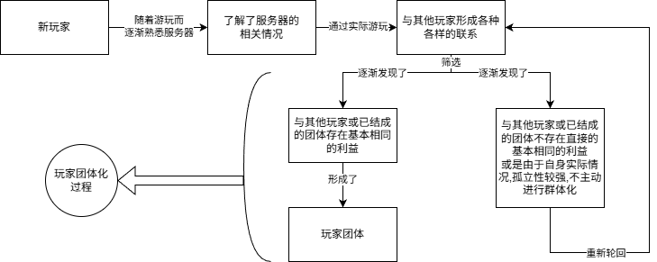
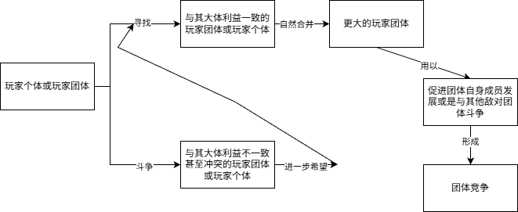

---
prev:
  text: '07.等级对立原理论'
  link: '/ServerOutlineOfTheTheoryOfHumanitiesGovernance/07-PrincipleOfHierarchicalOpposition'
next:
  text: '09.广义代差论'
  link: '/ServerOutlineOfTheTheoryOfHumanitiesGovernance/09-GeneralizedGenerationalGap'
---
## 08.玩家群体化过程论
### 引言
在上文,我们曾经提到过玩家团体化这一概念,实际上,玩家团体化的背后就是服务器发展中必然要有的一个过程,也就是玩家群体化过程,最主要的表现形式就是玩家团体化.为了行文方便,再加上玩家团体化是玩家群体化这一宏观过程中最直接,最明显的结果,也是对服务器发展影响最大的因素,因此我们下文大多以"玩家团体化"为主要论述对象.

为什么会出现玩家群体化过程?实际上,由于玩家有高流动性和高自由性,尽管服务器实际游戏内容方面将玩家严苛隔绝,玩家依然能有各种手段去和其他玩家建立联系,形成一定的社交关系.

由于人是社会性动物,必须在社会中生活,相互交流与合作.从心理学视角上来看,人类的思想,情感,信仰和行为都受到他人真实想象或暗示存在的影响,人类也会影响他人,例如有从众,偏见,攻击性,利他行为,旁观者效应等社会心理现象(可以参考群体动力学,社会认同理论等现实理论原理,本文不过多阐述相关内容),且一定的社会环境也会塑造个体行为.因此这种玩家间的交流,实际上就是一种心理和生物本能共同作用的结果,是没有任何办法阻挡的.
### 玩家团体化原理与五个基本问题
玩家团体化,实际上就算作是一种玩家群体化过程的通俗叫法.大多数玩家在服务器游玩过程中必然会经历从孤身一人,有所了解情况,与他人建立联系,发现有相同的利益,同他人关系愈发改善,最后到结成团体的这一群体化过程.实际上,只有少部分玩家由于其自身原因(比如极度内向),才不会在服务器游玩中经历这种群体化过程,大多数玩家实际上并没有这么高的孤立性,因此,这种群体化过程是大多数玩家上都会体现出来的,当数个玩家的群体化过程结果合并到一起,也就是形成了统一的利益共同体,那么也就形成了玩家团体,也就是我们所说的玩家团体化.如下图过程:

玩家团体化,经济危机,玩法僵化,代差(包括广义代差问题和除近距离资源枯竭以外的狭义代差问题),近距离资源枯竭是服务器治理中最普遍存在的一些问题,我们将其称作五个基本问题.尽管不是所有服务器都存在以上问题,但是其大多数情况下都必然要存在玩家团体化问题.

### 玩家团体化的目的性
一般来说,玩家团体的结成通常抱有一定的目的性,例如团体成员共同扶持,快速壮大团体成员自身在服务器中的实力,更好地满足所有人"寻找促进自身发展的机会"的最根本的利益,但是又因为具体利益和实际情况并不相同,例如,有些玩家不喜欢某些玩家本人或是其作风,有些玩家则认可某些玩家本人或其作风,或者是满足其利益的具体表现形式不同,比如在一个无规则服务器,一批玩家希望和平发展帮助新手,另一批玩家希望抢劫他人,壮大自身,总之,会因各种各样的问题,形成团体间的分化,从而形成各式各样的玩家团体.

一般来讲,每个玩家团体的根本利益的表现形式都是一致的,都是尽可能的通过团体内的互助促进团体成员的发展,进一步壮大团体的实力,提高其影响力,此外每个团体会有些具体利益,这些具体利益就是不同的,例如上文所说的在无规则服务器中和平发展的利益与抢劫他人的利益.

但是也有一些特殊情况,玩家团体的结成并不是因为目的,最开始可能只是玩家希望建立一些社交关系,满足在网上的交友等现实利益,而不是游戏中的利益,这虽然也是现实中存在的目的,但是其并不算作游戏范畴.

只不过这些通过社交关系等结成的玩家团体,最后可能会不自觉地就变成了游戏中的利益共同体,例如当在同一团体中关系较亲近的玩家占玩家总数过多时,其就有了一定的力量去抗衡其他玩家团体,玩家个体甚至是管理层,例如管理层要对该玩家团体内的某些成员进行合理管理时,可能会受到整个团体的威胁与反抗,或是管理层要进行某些玩法调整时,尽管已经经过了合理的检查,但是只要该玩家团体不同意,其也可以造成很大的风波,用其自身的人数优势一定程度上干预管理层的决议.

### 全面看待玩家团体化
玩家团体化是有利有弊的,一方面,我们要承认其确实将一些玩家牢牢地固定在了服务器,只要团体内部没有出现特别大的变革,导致大量玩家的流失,那么其就可以为服务器培养一些固定玩家,同时,玩家间的相互帮助,也有利于玩家个体的发展,一定程度上也可能做到缓解管玩矛盾,由于这些玩家间存在比较明确的具体利益的一致,玩家间矛盾也可能因此缓解(例如玩家团体内自动就会存在一定的协调玩家矛盾功能,其根本目的是为了维持团体存在而促进所有人的共同发展).

但是另一方面,我们也要看到玩家团体自身就是一种不稳定因素,由于玩家有诸多方式可以确保玩家团体的私下对话等活动绕过管理层的直接管理,我们无法确定该玩家团体会不会突然出现巨大的内部矛盾导致整个服务器的玩家矛盾和管玩矛盾被瞬间激化,随后该团体内大量玩家因不满而"掀桌子跑路"导致服务器玩家大量流失,损害了服务器的长期发展利益.

同时,玩家团体之间也存在着竞争,冲突与合作,这也是一种复杂的需要仔细考量的关系.

当玩家团体之间存在各种各样的利益关系,各玩家团体之间就可能存在着竞争,冲突与合作,这是三种最基本的关系形式.

当两个玩家团体之间存在着具体利益对立,例如一方希望和平发展,另一方则希望通过掠夺他人来促进自身发展,两个玩家团体就会出现冲突,尽管双方玩家团体最根本的利益都是要促进其成员自身的发展,但是由于实际手段不同,双方最终仍然会爆发冲突并一定程度上激化玩家矛盾.
### 玩家团体的自然合并
当两个玩家团体之间存在的具体利益的共同领域,例如一个玩家团体通过为新手发放物资,减少新老玩家代差(此处可以简单理解为降低新老玩家的物资差距,从而一定程度上降低新老玩家间的实力差距,具体代差内容请参考后文),另一个玩家团体通过修路等方式,便利新玩家的通行,双方的根本利益都是促进团体自身发展,因为这一定程度上也会吸引新玩家加入该团体,但是双方团体的手段都是和平的,有利于新玩家的,那么这两个玩家团体就会展开合作,甚至若情况允许,可能会合并为一个玩家团体,从而壮大了其实力.
### 竞争关系
竞争是最常见的玩家团体间的关系,主要也分为有利的良性竞争和不利的恶性竞争.竞争最常见的就是在战争服务器中,不同玩家团体都要招揽新人来促进自身团体的壮大,这有利于在战争玩法中取得更高的胜率,如果在这种竞争中双方使用的手段是合理的,例如促进新玩家的发展,给予其帮助等,这就是一种良性竞争,可以激发玩家团体的活力,如果是恶性的,例如,通过造谣诋毁等方式恶意攻击其他玩家团体成员,其就会激化玩家矛盾,甚至有可能引起现实中的冲突纠纷.一般来说,良性竞争有可能会随着本质淡化而转化为恶性竞争,而恶性竞争一般已经无法转化,这也就需要管理员加强对玩家团体的巡查监视,防止出现恶意竞争.

同时,我们也要清楚玩家团体最根本还是为了团体自身的利益而服务,归根到底依然是一种玩家个体利益的集中体现.一般来说,如果管理层不加以干预,玩家团体总会经历如下图的合并与斗争过程,直到最后形成大范围的团体竞争:

当出现大范围团体竞争时,若管理员继续不加以干预,一般情况下,最后服务器会剩下一个实力最强的玩家团体,也就是最终竞争的胜者.此时其规模已经足够大,已经存在了同管理层单独斗争的资本(或是玩家数量或是影响力等),那么多力量中心制衡的格局实际上已然被打破,因为对外开放的服务器的生命源泉在于玩家,而现在,如果要想服务器继续存活,就必然要满足这些玩家的利益,这些玩家如果集体跑路,服务器会突然暴死,那么此时已然形成了一种玩家团体一家独大的非对称局面,管理层实际上也就没有办法撬动该玩家团体了,因为直接处理的代价过于惨重,玩家团体也就倒挂成了控制服务器的实际力量.

### 倒挂格局的可能结果
一般情况下这些服务器会有两个可能的常见结局,但都不免走向消亡.只有少数情况下会有好结局.

一般情况下,这个玩家团体会寻找与其大体利益一致的玩家个体来壮大自身实力,并与自身团体利益相冲突的玩家个体斗争,这就会导致新玩家也被迫要接受甚至是加入该玩家团体,否则就只能退服跑路,显然,该玩家团体的存在会影响服务器新玩家的注入,很快,这些被视为敌对者的玩家会以各种非直接力量的方式对外"宣传"该服务器,实际上也就损坏了服务器的名声,最终新玩家注入越来越少,而老玩家却也因为各种现实问题不免的要离开服务器,服务器最终自然就要走向消亡.

另一种结局就是玩家团体竞争刚结束,该团体发现没有了竞争对手,对其造成的巨大冲击可能会导致所有人瞬间失去了继续游玩下去的动力,假设有一个玩家团体生来就是要对抗其他玩家团体,并且其成功了,那么其接下来的目标又该是什么?显然,大多数玩家团体竞争只是知道要同对手竞争,但是并不知道竞争结束之后其又该怎么办,某种意义上来说,存在竞争对手也是促进自身发展的一种动力,竞争对手不存在了之后,自身发展也会受到挫折,从而慢慢的,所有人都玩腻了,大多数玩家都会自然选择退服,而服务器也就要走向消亡.

好结局是,如果该玩家团体自身就是有一个较为普遍的利益,例如只是为了促进新玩家发展,或者其在团体竞争后能找到继续维持的理由或目标,如通过掠夺他人来满足自身团体利益的玩家团体,很有可能会突然崩解成数个玩家个体,然后重新陷入玩家团体形成的循环,再一次斗争组合合并,在不断的竞争中再次形成这样的玩家团体,再一次进行团体竞争,不断的循环往复.某种意义上来说,这对服务器也算是个好结局.

### 玩家团体化的双重性
那么分析完了玩家团体化,我们管理层又该怎么看待呢?实际上我们就是要辩证看待这一过程,首先就是不要试图以任何方式阻碍玩家的团体化,显然我们要看到其团体化的优势,也就是固定玩家,由于数个玩家都在一个玩家团体,其可能会暂时放下管玩矛盾,或是服务器自身玩法的不足等具体服务器的问题,转而把重点放在和其他玩家的游玩上,这有利于服务器管理层的管理和服务器的长期发展,其次,对于战争服务器或无规则服务器,团体之间的竞争冲突与合作确实也会激发玩家游玩的动力,从而让服务器快速进入繁荣期.

但是我们也要看到玩家团体化带来的不足,其最大的风险就是玩家团体影响过大时可能会破坏多力量中心制衡格局,形成一种倒挂的架空管理层局势,由于多力量中心制衡的格局被破坏,再加上玩家自身的局限性,其无法脱离管理层的管理,但此时管理层的管理已然无效,那么服务器实际上已经走向了消亡的道路.其次就是团体化带来的恶性竞争,以至于最终的激烈团体竞争等,都有可能会导致玩家的大量流失以及服务器名声的败坏.

此外,玩家团体化也有可能构成对其他玩家个体的霸凌,孤立.由于互联网上"声讨"一个普通人的成本实在过低,再加上玩家群体人多势众,很容易形成了对玩家个体的不合理欺压,可能会引起一些现实中的矛盾纠纷,不仅影响服务器自身名声和长期发展,更有可能会给双方玩家和管理层带来不必要的麻烦.

由于玩家团体自身是复杂的,一个方面就是其为了维护其自身稳定,团体内部会自动的调解内部的玩家矛盾,但是这有可能将玩家矛盾转成了管玩矛盾,不利于管理层的管理.玩家团体自身也可能会存在对团体内成员的包庇掩护,例如,当管理者搜集惩戒一个玩家的证据时,可能会突然出现一堆人来为玩家"打抱不平",从而干预管理者的判断,或者是该玩家团体动用人数优势抗辩管理者的惩戒,或是该玩家团体利用自身人数优势等垄断服务器内的部分权益,这都是我们要考虑的问题.

玩家团体的问题如果处理不好,就有可能演化成等级对立,形成了某个团体自身特有的优越性,或是加入某个团体就能享受到特有的特权(例如如果管理者认为某个玩家团体做得很对,给其一些特殊关照帮助,以辅佐其壮大,这实际上就是一种等级对立),尽管其初衷可能是正常合理的,但是只要随着本质淡化过程或是其他现实问题的深入,玩家团体自身就很容易形成了一些等级对立,再加上有些管理者对玩家团体化概念的模糊不清,自认为只要自身给予某个玩家团体一些帮助,就能扶持其对抗某个自身不认可的玩家团体,这实际上就构成了等级对立,激化了玩家间矛盾和管玩矛盾.

### 玩家团体化的适度干预方案
实际上管理者最终要清楚,玩家团体化最根本上是为了超越玩家矛盾,维护玩家个体利益而固有的一种进程,但是仅限于自身团体内.对于大多数服务器来讲,其管理者对相关问题处理的经验不足等可能会激化玩家矛盾,管玩矛盾,形成等级对立.玩家团体化自身就是一种极易激化玩家间矛盾的实体力量,稍有疏忽,玩家矛盾的激化就有可能转化成管玩矛盾的问题,从而不利于服务器长期稳定发展.

那么管理层究竟该怎么做呢?实际上,由于玩家团体化自身是无法阻挡的(这取决于玩家个体自身作为人的固有的生理和心理特点,再加上私聊工具普及,人的社会性需求,游戏自身协作性玩法的必然影响等,这一过程实际上必然会出现且不可阻挡),我们不能考虑任何手段去阻碍这一进程.其本身也没有一定的通解,必须要根据服务器具体实际情况,比如团体化进程的深度,去调整管理层手段,因此下方只是列出一些案例,仅供参考,而不可能用作通解.

一般来说,大多数小游戏性质的服务器,确实会存在玩家公会等相关机制,只不过这是严格受到服务器管理的,服务器在游戏内就提供了这种玩家团体化的平台,玩家可以自由的创建公会或加入退出公会等,每个公会具体的纷争,也就是在PVP等实际游戏场景中的胜负,并不一定会造成大规模的玩家的团体竞争,毕竟如果小游戏服务器自身玩法多样,玩家是不必局限在某一玩家群体所针对的单一玩法的,甚至哪怕其游玩相关玩法也不必非要加入该公会,此时相关公会之间的竞赛竞争等,大多数情况下都是积极的激发玩家活力的手段,管理层也比较容易在游戏内直接对相关机制进行管理,再加上小游戏服务器自身特有的玩法特性,尽管形成了玩家团体,但玩家团体间实际上不存在生存类服务器中如此紧密的联系,也就不一定会产生如上的各种严重后果.但是这种体系一方面要求服务器自身玩法就是小游戏服务器,另一方面又要要求服务器已经有一定的玩家体量和游戏玩法多样,要求较高.

如果是生存类服务器(例如无规则服务器,战争服务器或原版生存之类的养老服务器),则需根据玩法性质具体考虑.对于无规则服务器,管理者实际上可以直接"看海"(旁观玩家的发展),最多就是管理一下各个玩家团体不要整出实际生活中的矛盾,或是提前就做免责声明,声称玩家团体的行为与服务器管理层无关,这是取决于其无规则的服务器玩法性质.对于战争服务器也不能限制玩家团体化发展,毕竟战争本身就要求有一定的团体色彩,具体内容最好也是同上,对于无规则服务器和战争服务器,最忌讳的的就是插手干涉玩家团体的发展,这可能会造成等级对立,从而让其他玩家理解为服务器有特权化管理.对于原版生存尤其是养老等主张就是和平娱乐的性质,我们一方面要鼓励玩家们的社交等合理群体过程,另一方面又要维持好服务器的和平秩序,防止出现玩家团体对其他合理玩家的孤立,霸凌等,这就要求管理员必须高度了解服务器的实际情况,也就要求管理员要提高自身巡查效率,同时营造一个良好风气,设置多种渠道,允许玩家发声抱怨申诉.

无论如何,管理者的管理最重要的就是不要真正的去插手直接干预玩家团体,其次就是要防止玩家团体造成现实中的纠纷,最后就是管理过程必须公正,不要受到玩家团体的威胁,公正公明,就事论事,而不是被情感,人际所困,否则就会造成多力量中心制衡格局的失衡,实际上就造成了玩家团体的过大权力,形成了对管理层的架空.

我们也可以根据服务器具体实际情况等,通过改善民主议事制度,监测团体影响力,设置反团体垄断的人文规则等制度体制机制手段来尽可能控制住玩家团体化的局限性,更好利用玩家团体化的优势.总之,依然要坚持具体问题具体分析才能解决好这些矛盾.

各个服务器具体情况不同,玩家团体的作用方式也不同,因此必须考虑服务器实际情况.例如,某个生存服务器的建筑玩家组成团体,而这个建筑团体几乎包揽了服务器所有建筑玩家,其对于游戏实际建筑的影响实际上已经构成了一种垄断,如果管理层需要这个建筑玩家团体,那么当该团体确实不同意管理层的建筑决议,其便有足够的资本来抗衡管理层,实际上就架空了管理层的部分决策权.每个服务器都有可能出现不同的团体化情况,因此我们只能给出一些原则性的方案与可能有用的预设方案,具体问题必须要具体分析.

### 总结
玩家团体化或是说玩家群体化过程,实际上是服务器发展自身的一个固有过程,我们要保持对其的正确认识,一方面肯定其进步性,另一方面又要尽可能弥补其局限性,由于,每个服务器具体的玩法不同,具体的发展程度不同,其玩家团体化过程也必然不同,管理层必须做到准确分析形式,利用各种合理手段明确玩家间的实际游玩格局关系,从而制定合理的符合服务器实际的政策,平衡玩家团体,普通玩家,玩家群体之间的关系,又不确保自身被架空,同时又要尽可能缓和玩家间的非必要矛盾冲突,尽量避免出现因自身管理失误造成的管玩矛盾激化和等级对立.

玩家群体化过程实际上应该很早就已被发现,也已经出现过如小游戏服务器中公会之类的组织形式,但是就目前来看,大多数管理层实际上并不清楚其具体情况,也不知道其影响作用,作为五个基本问题之一,其是最难被解决的,也是造成的破坏力最大的,最难修复的,我们必须处理好玩家群体化过程相关的问题,才能更好的发挥玩家的作用,最终维持住多力量中心制衡格局的稳定,防止一方失衡,促进服务器长期发展.