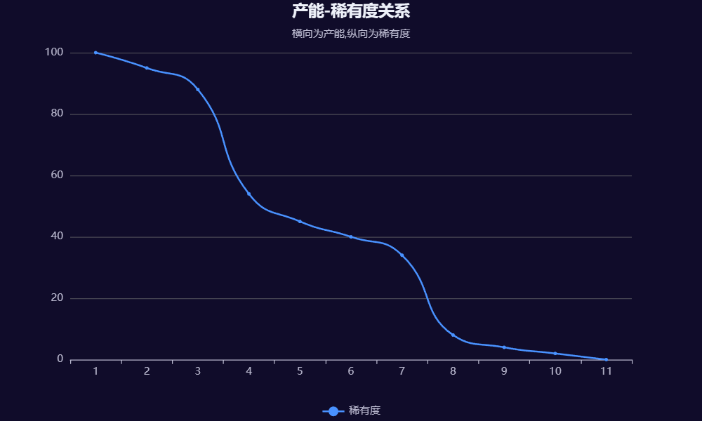
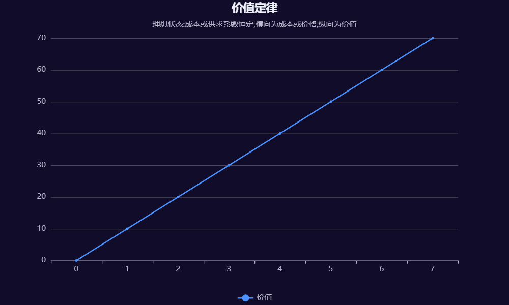
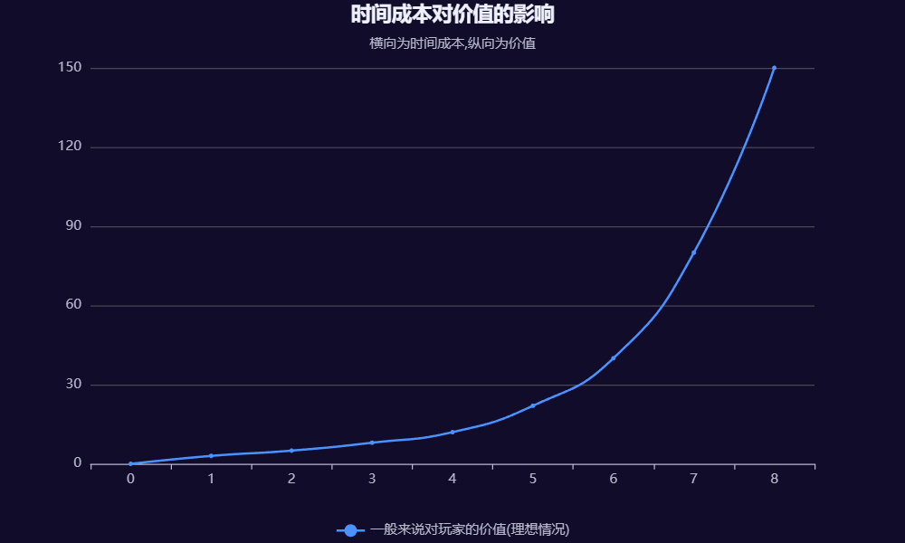
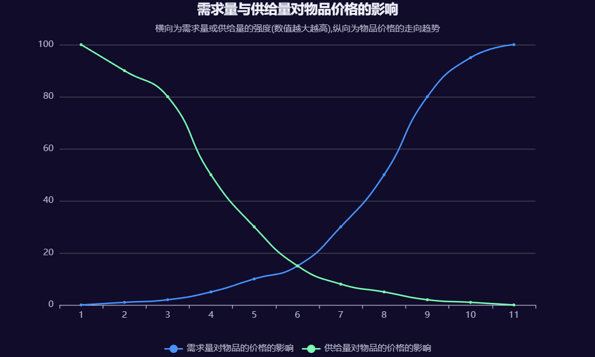
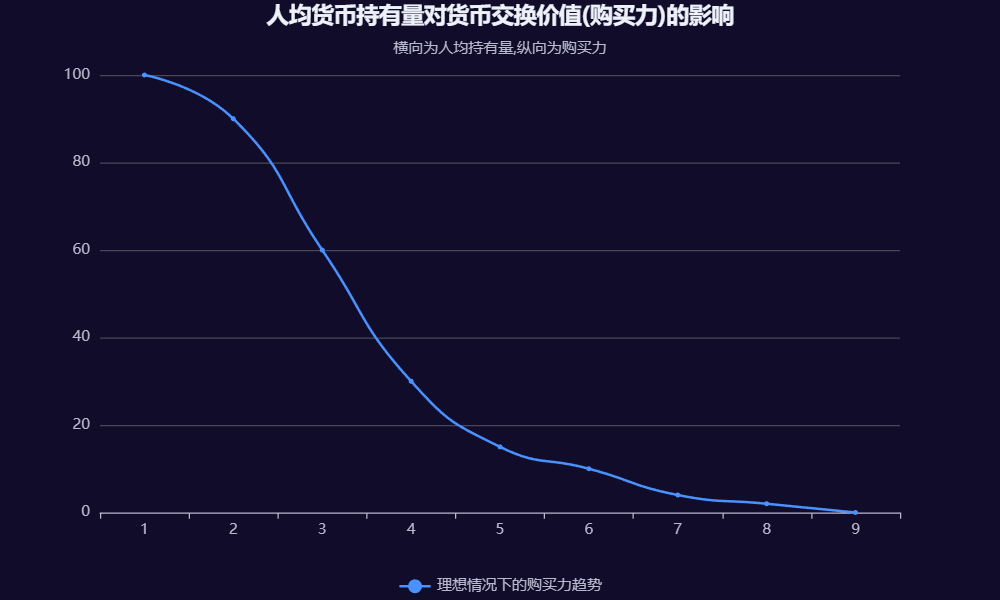
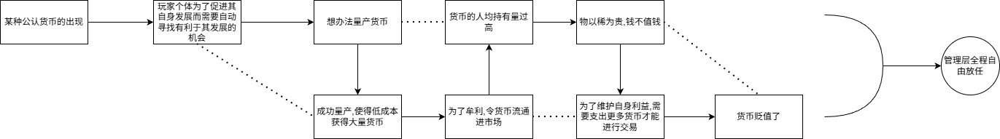
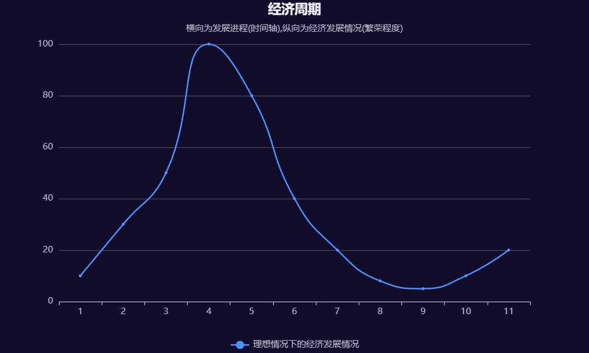
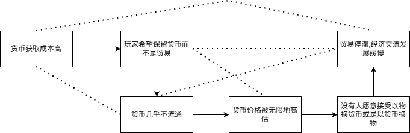

---
prev:
  text: '10.狭义代差论'
  link: '/ServerOutlineOfTheTheoryOfHumanitiesGovernance/10-NarrowSenseGenerationalGap'
next:
  text: '12.玩法论'
  link: '/ServerOutlineOfTheTheoryOfHumanitiesGovernance/12-Gameplay'
---
## 11.游戏经济学理论
### 引言
我们之前也在玩家团体化,代差等章节简单提到了一些游戏经济学问题的相关内容,如经济体系,经济系统,经济危机等.经济学问题对服务器的发展具有重大影响,例如经济危机就属于五个基本问题之一,玩家们的游戏行为大多数情况下也与经济问题密不可分,如为了促进自身发展,玩家们可能会自然结成类似于经济共同体的玩家团体,从而推进玩家团体化进程,或是新老玩家的代差更有可能体现在经济发展程度与资源占有上的不平衡问题.总之我们必须要重视游戏的经济学问题.

实际上,游戏经济学理论内容非常繁杂,本论纲也只能做到尽可能以更加通俗易懂的方式去解释相关问题,并尽可能给出一些实际解决方案(由于每个服务器的具体经济情况都有所不同,实际上基本不存在什么通解,也很难直接将其他服务器的方法搬运到我们自己的服务器中,必须根据服务器的具体情况进行相关调整).

### 对现实中经济学的不完全借用原则
在现实中的经济学的发展涉及到重农主义,重商主义,古典政治经济学,马克思主义经济学,新古典主义,凯恩斯主义,芝加哥学派,奥地利学派等.其自身涉及微观经济学与宏观经济学,包含对称经济学,空间经济学等分支学科.但是在游戏中的经济学却并没有这么多的分类,主要就是研究一些玩家或管理者的行为对服务器整体经济形势的影响,并分析这种经济形势影响对玩家或管理者行为的反作用.值得注意的是,游戏中的经济学分析与现实中存在很大不同,我们将在后文具体论述相关内容.

同时,在游戏经济学理论中部分问题的分析或结论等不严格局限于经济学问题本身,其一定程度上可以反映其他问题,如玩家行为的动因(例如玩家自主追求某些内容并为此付出时间成本的原因),玩家团体化的经济学原理(例如玩家团体化具有一定程度上的对各成员时间成本的综合考量与分配的作用,并可能追求时间成本的最优应用),狭义代差的经济学体现(主要是时间成本的问题)等情况,这需要我们具体问题具体分析,将其作为一个可用的分析原则,而不是孤立地排除经济学内容或盲目套用游戏经济学理论进行分析.
### 游戏经济学:辩证原则
一般来说,游戏服务器的各种经济学问题体现着服务器多力量中心制衡格局中的"游戏实际内容的力量","服务器管理者的力量"与"玩家及其自然团体化集团的力量"三者的具象化并相互制衡,且对服务器造成实际影响的服务器发展过程,这其中的每一个主体都发挥着不同的作用,但是其都有可能进一步维持经济稳定或是导致经济危机,这也体现了三个力量主体的复杂性,因此我们必须要全面地分析经济学问题背后的动因,用全面的辩证的眼光分析问题,切勿静止地孤立地片面地看待问题,无论什么问题都理应如此.
### 游戏经济学:产能-稀有度原理
首先,我们需要明确这个经济学理论到底什么时候才会生效,也就是说要明确什么时候会有这些经济学问题,什么时候不存在这些经济学问题.一般来讲,只要该服务器不存在明显的游戏物品价值崩坏且玩家具有在生存游玩中的高度的自由性,那么就存在经济学问题.

游戏物品价值崩坏主要就是指由于服务器自身玩法的影响,服务器中游戏物品已经不存在所谓的价值了,玩家也不会再考虑类似于物品的价值等经济学内容了,实际上这种崩坏更多是指由于产能过高,获取成本过低,物品交换价值实际上不存在的情况.一般来说,在专门的生电服务器中就不存在经济学问题,因为产能已经达到了一个极其可怕的程度,物品的数量是极多的,由于物品产能相对于其他服务器过高,物品自身的价值也就被拉到极低水平,例如,在其他服务器中绿宝石可能是一种比较有影响力与购买力的物品,但是在专门的生电服务器中,玩家有的是手段量产绿宝石,绿宝石的价值也就因此被拉得极低,就像现实生活中一样,物以稀为贵,但是在专门的生电服务器中只要该物品可以被量产,那就不存在稀有度的问题了.一般来说,产能和稀有度的关系如下图所示:

我们评价一个物品的产能对于稀有度的问题,需要其产能存在,因此最低产能系数(用于形容产能高低,数值越大产能越高)不为零.一般来说,存在两个阈值,产能高于第一个阈值后,该物品就从稀有变为了常见,此时该物品的稀有度会大幅降低,但其依然存在一定的作用与影响,当产能超过第二个阈值后,其稀有度也会大幅降低,但此时稀有度问题就已经不重要了.
### 游戏经济学:划分
玩家具有在生存游玩中的高度自由性,就包含了两个条件,一个是该服务器必须是生存玩法为主的,另一个就是玩家必须有高度的交互自由.有些服务器其玩法就是非生存,例如所有人在服务器中以创造模式自由建造建筑等,由于不存在对物品的经济学方面的需求(物品可以通过创造模式玩家的背包中凭空产生),这实际上也是一种游戏物品价值的崩坏.玩家需要有高度的交互自由,就说明玩家个体能够通过自身游戏行为实现对服务器经济的影响,例如,如果我们的服务器是空岛生存类型的,通过一些技术手段,将每个玩家单独设置了一个地图,玩家间没有办法进行交互,也就不存在经济学问题,但是如果存在系统供给的商店,允许玩家以某种形式进行交易,这一定程度上也算作是存在了经济系统.小游戏服务器中虽然存在可能积分等类似货币的机制,但是其玩家没有高度的自由性,能兑换的物品也是有限的,且也不会真正用于其生存中,我们认为,如果不存在玩家间可以进行相互经济交流的市场形式,那么哪怕存在所谓的经济,其也只能算作是简单经济学问题,而不是复杂的经济学问题.

不难注意到,也有相当数量的服务器同时具有系统商店等游戏机制和玩家间自由贸易的情况,尽管其仍然属于复杂经济学的范畴,但需要做出内部区分.对于这种复合问题,需要明确区分简单部分和复杂部分,简单部分针对于玩家-系统机制之间的问题,复杂部分针对玩家之间的问题,其分析原则也有所不同,必须坚持具体问题具体分析.

同时,本章中所指的"物品"是广义的,既可以指物品本身,又可以是各种能够承载时间成本的客观载体,换而言之,其在一定条件下可称作是物.
### 价值定律
就像现实中的价值定律,价值等价于需求,脱离需求则无法独立存在,在成本或供求系数恒定时,价值随价格递增而提升,当价格或成本为零时交换价值消失.如下图(理想状态):

那么只要这个服务器使得各种游戏物品脱离了实际需求,或者是使其成本可以看作为零,那么其就不满足价值定律,也就不存在相关的经济学问题了.因此我们可以说在生电服务器这类的产能极高的服务器中,由于产能理论上可以看作无穷大,根据价值定律,这时其成本几乎无穷小,也就可以看作是为零了,此时各个被量产物品也就没有什么价值了,只剩下了作为游戏道具而存在的在游戏实际游玩中存在的功能.而如果玩家并不是生存模式,例如玩家们用创造模式共同在一个服务器中搞建筑,由于此时的物品可以凭空从玩家的创造模式物品栏中产生,其成本也是无穷小,甚至可以看作零的.
### 游戏经济学:价值的主观性考量
那么,在游戏中某个物品的价值是怎么产生的?这取决于多种复杂的因素,客观来说,就是在玩家对某个物品有客观的需求(可以是物质上的也可以是精神上的)的前提下,物品自身的稀有度和玩家获取它所付出的成本特别是时间成本来共同决定的.

在游戏中,我们认为物品本身是可以没有价值的,只是有其作为游戏特殊道具的作用,而一旦玩家有了对其的客观需求,比如说需要钻石和下界合金来制作趁手工具,或是对樱花树木和龙蛋等的精神上的追求,该物品对玩家便产生了一定的价值,与此同时,物品自身的稀有度也就发挥了作用,例如一般情况下,如果管理层不稍加干预,龙蛋大概率只有一颗,如果该玩家有对龙蛋的精神需求,那么这颗龙蛋的价值就是极高的不可估量的.玩家为了获取该物品所付出的成本尤其是时间成本,是最重要的影响因素.由于游戏不同于现实,我们不能盲目将现实的情况带入到游戏场景,实际上,游戏场景中一件物品的价值就是这样简单产生的.玩家为了获取一个物品,必然要付出一定成本,例如自己的精力(甚至某些物品在玩法设计中可能需要玩家花钱才能获得),但是最主要的一定是玩家付出的时间成本,无论如何,玩家为了获得该物品,一定是消耗了时间,如果玩家明知获得该物品要消耗大量时间,还是为了其而付出,那便更可以证明该物品对玩家的价值,如果玩家是为了促进其自身发展而必须付出相观时间来获得该物品,那也可以用来展现该物品在某一时期对玩家的相对价值.例如,在一个玩家还是刚起步的发展阶段,其可能对铁的需求量更高,因此,铁对该玩家就是非常有价值的物品,玩家获取铁的时间成本要相对更高一些,也占据了其游戏时间的主要内容,而到了后期,玩家获取铁可能会更加轻松,但是想获取钻石,下界合金就需要付出更多的时间成本了,那么铁的相对价值就下降了,因为玩家一方面对其的需求少了,再加上铁字身的稀有度所固有的限制,获取钻石和下界合金的时间成本确实高昂等,钻石和下界合金对这位玩家来说又是非常具有价值的物品了.

这也是游戏中经济学理论和现实中最不同的地方,现实中,一件物品的价值或许有各种各样的因素影响,但是在游戏中最根本因素的就是玩家获取该物品所花费的时间成本.如下图表示:

并且一般来说,该物品对玩家的价值并不是简单地随着时间成本而像一个一次函数一样地稳定地递增,更偏向于指数爆炸式地增长,一般来说,超出一定阈值之后(根据玩家实际情况),其如果仍然追求该物品,那么在此基础上每为其额外付出一定量的时间成本,其价值就会进一步大幅度地指数爆炸式地上升.

### 游戏经济学理论:时间成本对价值的影响
现实中物品价值分为使用价值和交换价值,用以衡量其多有用或者多么值钱,但是在游戏中,这些物品的用途通常是由游戏玩法自身而固定的,也取决于玩家的发展进程,也就考虑到了玩家的需求,例如在发展初期,玩家对铁的需求一般要高于石英,此时,铁对玩家来说是很有用的,那么我们可以认为在游戏中,这件游戏物品的使用价值就体现了出来.而在服务器实际游玩中,如果该玩家能够通过与其他玩家的交换互动这类的市场组织形式等进行贸易,例如所有玩家都认为在现阶段钻石是非常有用的,那么钻石对所有玩家的这种交换价值就是非常高的,因为其非常值钱.

但无论如何,这背后都体现着玩家为了获取一件物品而要付出的时间成本,因此我们可以得出一个在后续经济学理论中都要用到的通用结论:一件游戏物品的价值归根结底要取决于玩家获取他的时间成本.
### 价值与价格
值得注意的是,价值不一定等同于价格.在现实中,价格是指商品或服务的货币表示,而价值是指商品或服务的实际用途或贡献.在服务器中也有相同的道理,价格是玩家们在一定的交互型的市场贸易环境下所衍生的一种对某件物品通过某种货币机制的表现.在现实中,价格通常由市场供需关系决定,而价值则由商品或服务的实际效用决定.在游戏中也具有相同的道理,例如如果一个玩家不参与到玩家间的市场环境等背景下的商品贸易,那么,大多数物品对于其是有价值的,但是对于特定背景下的价格对其却可能并不会产生过大的影响.
### 游戏经济学理论:主观性考量
玩家付出时间成本,并且愿意以这些成本去换取该物品,确实是说明了该物品对玩家的特殊价值是极高的.因为价值更多情况下是主观的,有些玩家认为,打龙后的龙蛋很有纪念价值,有些玩家则认为就是一件物品而已,认为其没有什么实际作用,也就不重要,这就是受不同玩家主观影响下的同一游戏物品的价值.而价格普遍是客观的,实际上是由供需关系决定的.例如,某个玩家认为某件物品对于自己来说价值确实好像没多高,但是只要在特定的市场形式的环境下,存在例如需求量远大于供给量的供需关系问题,那么该物品的价格就会确实提高而不受制于该玩家的主观想法.供给量与需求量对物品价格的影响如下图所示:

那么,根据这一原理,我们便容易得知大多数服务器经济问题难以管理的真正原因了,因为玩家行为具有高度的自由性,如果其确实存在经济问题,玩家为了促进其自身发展肯定会想办法降低获取其所需物品的时间成本,最好的办法就是通过造一些机器等量产,也有少部分人通过刷物品,开挂,矿透等作弊手段.对于后者我们一定是要坚决打击的,因为这直接破坏了服务器的游戏平衡,但是对于前者,玩家确实是在正常游玩,但是显然,如果其确实做到了开始量产某一物品,该物品对于该玩家的成本确实会显著降低,如果玩家将其低成本获得的物品投入到具有市场性质的贸易环境中,经济问题便会爆发.但我们又不能真正抑制玩家的合理游戏行为,例如只是为了防止这类经济问题就要禁止玩家使用各种机器吗?大多数服务器禁用一些机器都是因为太卡了,而不是因为可能会造成经济学问题,这也会打击玩家的游玩兴趣,因此需要管理层根据实际情况谨慎考虑.

根据上文论述,我们已经知道了经济学原理最基本最核心的要义:玩家为了获取一件物品获得的时间成本决定着一件物品的对其的价值,并知晓了经济学问题的特殊性和复杂性,进一步了解具体问题具体分析的重要性.
### 游戏经济学理论:意义论
从更深层次的角度来讲,时间成本地位极高,取决于时间成本的一个特性:对于目前的自然人具有平等性.玩家要获取一个物需要付出时间价值,无论是刷物品,使用作弊手段,还是自己找等各种形式,其都要在服务器这个客体上付出时间成本,哪怕其雇佣现实中的他人代其游玩,雇佣的损耗也需要来自于其现实的成本,并且也不可磨灭地消磨了其自身游玩的时间(例如协调沟通等),或者是任何手段,都会造成时间的损耗,而这些时间花费对于现实中的自然人来说是无价的,也是等价的,人的时间都很宝贵,时间对于现实中的人是相对更加平等的,哪怕玩家间技术差距再大,机器产量再高(建造和提取之类的都需要对其花费一定时间,只要主观上去想,实际上就已经花费了),时间都是平等的,因此时间成本才能有这样高的地位.

同时,简单经济学问题和复杂经济学问题的划分就在于此,简单经济学问题不涉及自然人主体之间的关系的意义,也就是说,时间成本的客观载体不在玩家之间流通,而复杂经济学问题中,存在一个渠道,使得玩家之间可以通过流通时间成本的载体来进行贸易,整合不同自然人主体的时间成本关系.而复合问题中由于存在符合复杂经济学问题要求的渠道,因此从整理时间成本,调整不同自然人主体之间关系的意义的角度上看,复合问题是复杂经济学问题的特殊表现形式,此时由于其简单部分中的系统机制不是自然人主体的所有交换对象,可将将其理想地看作从纯游戏机制变化为了可被管理层应用的政府宏观调控机制,以调节玩家间市场贸易的不足,这一方面带来了机会,应用得当,可以适当调节经济情况,当玩家的自由市场贸易出现崩溃,其可以作为回收机制或重造机制(通过大规模回收该物或大规模贩卖该物等重新调整玩家获取其要花费的时间成本,也就从调整客观上的获取其的时间成本的必要客观支出,从而一定程度影响其在玩家心中的主观价值评估,通过该行为本身间接影响价格与市场占有率,但并非强力的绝对有效机制)等弥补经济漏洞,但是应用不当,管理者就会破坏经济周期,造成经济危机,激化狭义代差甚至管玩矛盾.

在游戏经济学我们特别讨论物的意义,意义是该物自身具备的实际用途与其对于玩家的主观意义的有机结合,其实际用途会影响玩家对其的主观价值的评估.在后文我们将论述时间成本的流动与蒸发问题,在此处预先做出一些基础意义论说明.对于简单经济学的研究涉及部分,系统商店产生的物也具有一定的时间成本意义,玩家确实用其付出了时间成本的物去进行交换,表面上看是凭空产生了新的物,不应当承担任何时间成本,也就是按理来说玩家的时间成本被蒸发了,但实际上由于系统商店这一类属于游戏机制,不是自然人主体(哪怕是管理者,其也算作是自然人主体),游戏机制主体属于游戏内容的力量,其自身具有抗本质淡化的特性,玩家的交易是在自愿认可为基础的情况下进行贸易的,其可以选择是否进行该操作以处分其付出的时间成本,那个通过商店产生的新物是继承了玩家的旧物的时间成本,换而言之,尽管客观用途之类会影响其价格与客观价值认定,但是主观价值上,玩家一般认为其大体是相等的(也就是该物可以值得其付出对应时间成本),是玩家自行赋予的意义,时间成本在此处不完全守恒,但总体上是存在的.尽管玩家有各种手段缩短生产一个物的时间成本来从商店套利,但其实际价值判断仍受实际客观时间成本(客观上到底花费多少时间)和主观时间感受(主观上真正被感觉是实际花费的时间)的影响,且这符合玩家寻找有利于其发展的机会的要求.例如玩家通过极简易刷铁机(假设有实际因素阻碍效率),使得铁锭产量到达每小时100个,客观上,其只需要付出一小时的等待就有100个铁锭,但是主观上,其可以自由支配时间干别的事,而非苦苦等待,因此其主观感受几乎是没有对于铁的时间成本付出,此时玩家认为铁锭值某个价格实际上主要考虑了效率以及其感觉的判断,因此不能完全反映其实际付出的有效时间.但是玩家用以从系统商店贸易,其可以以少的时间成本换取有意义的物,这是值得的,因此若允许,其可以这么做,并且那从系统机制凭空产生的物会承载其自身意义和玩家实际认可的时间成本意义,这就是价值,这里的意义是被玩家自己赋予的,也不存在不同自然人主体的不对等情况下的时间成本单向聚集与消费.

复杂经济学讨论的范畴中,被交换的各种物品承担的各种意义一定程度上就是该物的时间意义被不同自然人主观价值考量后的赋予,例如依然借用上述背景,玩家A认为其用刷铁机刷的铁锭在他自己那里是不值钱的,因为他获取其不必付出大量时间成本,但是在大的背景下,只要铁锭交换意义仍存在,其就可以进行交换,此时其用铁锭交换不需要付出大量主观时间成本,因为机器解放了这些占用,其不清楚在现在实际需要多长时间才能获得这么多铁,但是,如果其要交换,就必须对于交换价值有所断定,如果太贵了,就没人来贸易,如果太便宜了,短期内可以大量获取贸易订单,但是长期来看这可能会引起铁贬值,或者管理层看见之后进一步采取措施,且这显得自己那付出的附加成本,如技术,占用土地等和其客观的等待一文不值,且会迅速掏空库存,为了可持续发展,理想上(一般情况下也符合该情况)其会选择一个适中价格,但是这个价格是估计的,同时玩家B需要这些铁(假设无刷铁机),并提供玩家A愿意购买的东西,或者是B急需A的那些数额的铁(考虑客观情况),必须和A贸易,那么无论是什么情况,其都要和A贸易,此时A没有付出巨额的针对于其现实生命的时间成本,因为机器解放了生产这些资源的主观时间成本要求,如果玩家B的物品是自己切实花费大量有效主观时间成本获得的,其主观时间成本的支出要更高,那么如果双方达成了贸易,尽管价格谈好了,但B确实付出了更多的实际意义上的时间成本,因为时间是平等的,多了就是多了,尽管B实际上的客观时间花费可能也是A等待那些锭的时间,但是主观上B就是"失去了"更多实际有意义的时间,因此B获得的铁只是A那稀少的主观时间成本,A获得了B那更多的主观时间成本,A相当于是在这场"自愿平等贸易"中"获利"了,如果其每次都能"获利",其就会实际上夺走更多的主观价值,尽管价格可能是双方自然人认为近似平等的,但其间接地夺取了对方更多的有效的发展机会(有意义的时间成本).如果B的物品也是刷的,但是效率不高,或者未能实际上解放生产时间的要求,那就不能"获利",但这要具体分析刷的对象的价值情况,综合考量获利情况.

无论如何,游戏经济学理论中时间成本对于价值的影响的考量必须要经过具体问题具体分析才能落地(例如A建造一个雕塑用了5小时,其认为如果要卖,怎么也要值得上相关的付出,但是B认为无关紧要,因为其认为雕塑没实际意义,那么双方对于该物的价值判断评估就不一致,其对于A来说值钱,对于B来说不值钱,其价格需要看整体需求等情况),这里是对其意义的理想化概述.

### 游戏经济学理论:简单经济学问题
在之前我们提到了简单经济学问题和复杂经济学问题,简单经济学问题实际上就是只针对于玩家个体而产生的问题.例如,一些以单人玩法为主的服务器(如单独为玩家做出区分的空岛生存服务器等),哪怕存在相应的商店等经济机制,其只针对于单个玩家,因此也不存在过于严重的经济问题,其更类似于一种游戏机制,是便利玩家发展的,玩家也有交换之类的经济活动(只不过是针对于玩法自身而设计的系统的商店,交换双方并不全是人作为的实体,一方必然是系统等非人实体),但是作用对象也只针对于玩家自身,而不对于整个服务器,此时也就不存在经济危机的问题,或者说这种服务器的经济体制只是一种"像经济学的游戏机制手段",或者说是"拟经济学机制".

对于类似小游戏服务器等虽然存在各种积分等货币贸易机制,但是由于玩家的游戏玩法不是传统生存类,其通过贸易获得的道具等也只是为了更好地促进其自身游玩服务器,这种服务器的"经济体制"也只是表面上的.

实际上,对于简单经济学问题,特别是其甚至在大多数情况下甚至不算是传统意义的经济学问题,通常由简单经济学问题引起的服务器问题都是由于服务器玩法不合理或是存在漏洞而引起的,例如是否考虑到了玩家可能量产某一物品,或者是使用刷物品等手段,从而利用其低时间成本获得的物品大量换取商店的物品等问题.要解决这种问题,一方面就要求管理层设计服务器玩法时,不能一股脑乱填数值,必须具体问题具体分析,设计多重保障手段(例如注重时间成本与收益的匹配原则,获取难度应与物品效用成正比;尽可能避免单一物品成为"通用货币";通过一定的防套利设计,阻断"低买高卖"的无限循环等手段),根据实际情况设置机制,最有效的办法就是管理层亲身实践,自己实际进行游玩,来检验自身服务器玩法是否存在不合理,或是设置内测机制,允许玩家故意去"找茬"等,完善服务器玩法,弥补服务器漏洞.归根到底依然要重视实践,在实践中检验服务器玩法的合理性,促进服务器的长期发展.

对于这种简单经济学问题,其产生是受制于服务器玩法自身漏洞,如果其要转化为复杂经济学问题,必然要出现双方都是人作为实体的玩家交换的市场背景,而不是单一的玩家同某个固定的系统交换.

这与前文所述的狭义代差形成对照,这种狭义代差源于玩家进服时间或能力差异,而简单经济学问题源于玩法设计本身,二者虽独立产生,却可能在复杂市场条件下相互强化.这也需要我们根据服务器具体情况进行实际的分析.

由于简单经济学问题的背景就是在玩家单一游玩服务器的情况.其虽以玩家-系统交互为特征,但其设计缺陷仍可能间接加剧代差,例如若高技术水平玩家能更快破解系统交换的套利机制,其经济优势便可能转化为团体凝聚力.然而,经济学问题对服务器治理的真正挑战,在于复杂经济学问题:当玩家-玩家市场形成,经济力量便独立于管理者意志而运转,此时我们也就需要系统性的经济治理框架.

### 游戏经济学理论:复杂经济学问题与货币
接续上文,我们需要重点关注复杂经济学问题.但是我们之所以将其称作复杂经济学问题,就是因为其极其复杂,理解难度较高,在重点论述之前,我们不妨先了解一些现实中的经济概念与其在服务器管理的对应.

我们之前也提到了货币这一概念,显然,只要玩家间存在市场,双方要想进行贸易,必须要有一个统一的货币作为一般等价物.

尽管大多数情况下在服务器游玩中,玩家们更可能以物换物,但是在以物换物的背景中,双方使用的物品某种意义上来看也可以算作是一种货币.有些服务器或许会采取经济插件,其中如积分或点券就是一种货币,或是通过各种游戏手段强制规定一种通用货币.玩家们可以通过各种手段获取这种货币.

一般来说,在没有强制干预下的玩家以物换物的自由模式中,货币需要具有一定的认可度,例如玩家们或许都能认可钻石作为一种货币,但是却又不一定都认可把圆石作为一种货币.这就取决于这种货币对玩家自身发展的价值.由于钻石在大多数情况下比圆石更加有利于玩家发展,再加上钻石的获取难度较高,而圆石的获取却很容易,玩家要获得钻石需要付出更高的时间成本,随着自然演化,玩家们就认可了钻石作为一种货币,此外其他物品也会经过这种自然演化而逐渐被玩家认可,最终服务器中就自然而然地形成了几种实际上的货币形式,也就是出现了经过了玩家们的筛选而足以充当货币的某种物品.

而对于有强制干预的统一货币体系,这就需要管理层平衡货币的价值.例如玩家要想获得货币最好的办法就是完成游戏玩法规定的一些任务,或者说是通过游戏中的物品交换.那么我们就需要根据实际情况规定玩家可以通过某种手段获得多少货币,例如玩家完成某种任务的难度很高,那就可以根据实际情况多奖励一些货币,玩家获取某件游戏物品需要付出的时间成本较高,那么该物品就可以更多的兑换一些货币.然而,管理层对兑换比率的设定若偏离玩家实际的时间成本评估,便会催生灰色市场:玩家倾向于绕过官方机制,回归以物易物或私下交易,使强制货币体系名存实亡.实际上,我们必须要让玩家认可这一套官方的货币机制,才能确保其的合理推行.

### 复杂经济学问题:货币的贬值性
但是无论如何,货币都存在一定的潜在的贬值问题,也就是货币不值钱了.像现实中的钱不值钱一样,当所有人都有很多的货币,那货币实际上就相对贬值而不值钱,也就是因为物以稀为贵而自然造成的贬值.其购买力会自然下降,并且往往和通货膨胀相关联,过于严重的通货膨胀会导致恶性经济危机.在现实中就是经典的德国"50万马克买一个面包".如下图表示:

由于货币必须要有人持有才有购买力意义,无人持有的货币就不存在其作为货币的功能,故上图最低的理论持有量系数(用以形容人均持有量水平,其数值越大,人均持有量越多)不为零.依然存在一个阈值(根据实际情况),当人均持有量超出该阈值后,货币的购买力会显著降低.且当货币的人均持有量实际到达了极高水平,那么其作为货币的交换价值也有可能自然消失.

如果玩家形成了自然的以物换物市场,并且公认绿宝石是一种通用货币,但是,有玩家可以通过村民交易所自己量产绿宝石,那么玩家就通过这种低时间成本手段拥有了大量的绿宝石,当时直接把绿宝石流通进市场时,绿宝石的存有量就过度提高了,如果玩家们都有了很多绿宝石,玩家们肯定会为了促进自身发展而对其他物品进行加价,也就是使绿宝石发生了贬值.一般来说这种自然贬值是不可避免的,尤其是管理层采用一种消极的无为态度,自由放任,由于玩家会自动的寻找最有利于其发展的机会,很快所有人就都会想办法获取更多的货币,也就会造成其贬值.作用过程如下图所示:

如果该市场是有管理层干预的,例如经济插件使得玩家必须通过购买点券或积分等中间货币手段,与其他玩家进行经济活动.但是同上文一样,由于我们无法过多的干涉玩家的合理游戏行为,但是游戏自身却有可能会出现任何意义上的量产某种物品的方式,例如绿宝石可能可以通过村民交易所量产,如果服务器的反作弊不好或是未能做出有效阻拦,玩家可能可以通过矿透在短时间内获得大量的矿物,就使得所有矿物都可能发生贬值,再加上大多数矿物资源是不可再生的,该玩家极有可能形成对矿物的实质上的霸权垄断,进一步引发近距离资源枯竭或是其他恶性资源枯竭等实质的加剧玩家代差的行为,其本身行为也可能激发玩家矛盾,使得玩家自然结成团体去对抗,从而推动玩家团体化进程.

### 复杂经济学问题:通货膨胀
游戏中的"通胀"呈现两种形态:单一货币贬值(如绿宝石因量产而购买力下降)与普遍物价上涨(若所有可交易物品获取难度同步降低)前者源于特定货币的供给过剩,后者则意味着整个服务器经济系统的价值基准漂移.

根据上文,玩家间因经济优势形成的代差,正是前文所述狭义代差的深化形态,也就是时间差异(新老玩家)和能力差异(技术水平)转化为资本差异(货币与资源占有量),使代差从发展速率的差距固化为市场权力的不平等,实际上就会加剧玩家间矛盾.

### 复杂经济学问题:货币的必然性与市场
由上我们可以看到,只要存在复杂经济学问题就一定会存在货币的问题,只要有货币就一定会存在贬值与通胀的问题,这主要取决于玩家们的交易实际上已经形成了一种市场.而市场的作用将会更加复杂.市场的复杂性不仅体现在货币层面,更在于市场在服务器中的交换,反馈和调节功能,以及经济周期对服务器生命周期的反作用.我们将在后文做出阐述.

### 简要市场概念与比较优势的实践改造原则
对于服务器,市场的交换功能表现为以市场为场所和中介,实现商品交换的活动(一般来说,可以理想地认为只要存在玩家之间的贸易交换等活动,就存在一定意义上的市场).商品生产者出售商品,消费者购买商品,以及经营者买进卖出商品的活动,都是通过市场进行的.市场不仅为买卖各方提供交换商品的场所,而且通过等价交换的方式促成商品所有权在各当事人之间让渡和转移,从而实现商品所有权的交换(在此处,商品的概念是广义的,不局限于常规游戏经济学理论中所特指的狭义概念上的可以用来交换的游戏物品).

市场把交换活动中产生的经济信息传递反映给交换当事人,就是市场的反馈功能.商品出售者和购买者在市场上进行交换活动的同时,不断输入着有关生产,消费等方面的信息.这些信息经过市场转换,又以新的形式反馈输出.对于玩家,其可以根据商品的市场销售状况的信息反馈,对其需求潜力做出判断和预测,从而决定自身要生产什么样的商品以牟利.

调节功能指市场在其内在机制的作用下,能够自动调节社会经济的运行过程和基本比例关系.市场作为商品经济的运行载体和现实表现,本质上是价值规律发生作用的实现形式.价值规律通过价格,供求,竞争等作用形式转化为经济活动的内在机制.市场机制以价格调节,供求调节,竞争调节等方式对生产,分配,交换,消费的全过程进行自动调节.

由于篇幅问题,对于市场的具体作用,我们只会在后文涉及相关概念时论述,具体内容可自行了解.

对于现实中的比较优势指的是在生产某种商品或服务时,某个经济主体以低于其他主体的机会成本进行生产,从而通过专业化分工获得更高效率和收益.比较优势强调机会成本的相对低高,而非绝对生产能力,即使一个主体在所有产品或技能上都不具绝对优势,也可以通过专注于自己相对劣势最小的领域参与交换或贸易,从而实现互利共赢,其核心在于专业化分工,通过集中资源生产最具比较优势的产品,提高整体生产效率和市场收益.

对于服务器来说,比较优势主要体现在时间成本的问题上,由于玩家的根本利益是寻找有利于其发展的机会,这个根本利益正是分工和贸易的一大动力.例如,假设服务器里有两位玩家,A拥有很大的农产品基地,B是一位建筑大师,A可以随意获得大量的农产品(A自己用不完),B却难以做到,同时,A造一座普通规模的建筑需要跟随教程花费4到5个小时,B造同样的建筑却只需要大约3个小时(当然,B自己也不需要这么多建筑),且B的建筑能做得更好,那么,与其各自都花时间去建造建筑和获取农产品,不如各自专注于自己最擅长的领域,然后用自己多余的产物去交换对方的产物,这就是比较优势在服务器中的运用,在这个过程中,双方都获得了更大的利益,他们一部分的时间成本都被解放出去了.

这是一个理想的情况(需要一定的玩法,服务器环境等做必要前提,但是其分析原则可以合理移用),实际上,哪怕双方在各领域的效率差距再低,但只要还存在相对的效率差距或是时间分配存在可以优化的空间(目的是借此获取更多利益)等实际因素,就可能会存在这样的同类问题.

但是比较优势却并不需要被完全借用,由于其自身在现实中就存在固有局限(实际上,比较优势原理是一种静态分析方法,而对于比较优势,其对假设前提要求十分严格等问题就属于其固有的局限),在游戏经济学,我们更需要将其进行实践改造,换而言之,这可以是一种审视时间成本问题的视角,但需要注意具体问题具体分析,注意"不完全借用"的原则,不能盲目套用,因此,游戏经济学理论中对于此概念的直接讨论就到此了.
### 复杂经济学问题:经济周期
经济周期指经济活动沿经济发展总体趋势经历的规律性扩张与收缩过程,通常分为繁荣,衰退,萧条和复苏四个阶段,在图形上对应顶峰,衰退,谷底和扩张的交替轨迹.

一般来说,当服务器某一周目刚开启,经济会迅速发展并快速进入繁荣(由于玩家活力普遍较高),而当服务器发生变故,例如玩家矛盾,等级对立,玩家团体的不当竞争和管玩矛盾的激化等问题,就会使经济衰退,如果发生了玩家人数的锐减,例如部分玩家家由于团体竞争而导致退服,或是受制于其实际情况(生活条件)而必须退服,服务器的经济就会萧条,也是大多数服务器最容易消亡的一个阶段,此时,很多服务器的管理层会认为服务器已然崩溃,而宣布服务器生命告终,准备重开周目或者关服,实际上,其往往没有考虑到复苏的可能性,当然这也并不怪罪于管理层自身考虑不充分,大多数服务器由于其实际情况,撑到经济复苏的概率实在过低,或者说受制于其自身玩法,其更有可能必然经历这一阶段时的关服(例如一些战争服务器主打的就是打完之后就准备重开,而一般在团体竞争后经济陷入萧条,恰好符合其玩法要求).但这并不意味着经济复苏的可能性就为零,只要还有后续的新玩家注入,就有可能存在经济复苏.一般来说,经济周期的示意图如下:

### 复杂经济学问题:货币问题与时间成本原理
综上考虑,我们知道了货币问题,市场问题是复杂经济学问题的核心问题.接下来我们将围绕这两个问题进行进一步的具体的经济分析.

我们先来讨论货币问题.首先我们需要记住一个前提条件,在复杂经济学问题中,玩家为了获取某一物品而支出的时间成本不仅是价值的度量,更是市场均衡的基石,任何使时间成本蒸发(即脱离市场流通而消失)的机制,都将破坏这一均衡,这也是货币问题和市场问题的有机联系之处,我们不能将它们单独分割开来看,因为其往往是高度绑定的.

实际上游戏中并不存在较为理想的原版物品的货币,作为一种货币,首先我们就要考虑如果不对玩家的行为做过多干预,玩家有办法量产它吗?如果有办法量产,那这种货币还有意义吗?如果我们过多的干预了玩家的行为,比如说确实禁止了可能作为货币的物品的,比如如果服务器配置禁用了刷铁机,村民"打骨折"交易所等,那这会不会又限制了玩家的活力呢?会不会激化了管玩矛盾?显然如果我们想要激发玩家活力,我们就不能过多的干预玩家的合理游玩,要不然玩家也有可能通过各种非直接力量手段如外部舆论等作用于服务器,实际上就不利于服务器长期发展.

但是如果该物品确实已经没有办法被量产,又需要不能过于轻松的获得,那么玩家又会不会比较珍惜自己付出的时间成本而不轻易将其用作贸易?例如很多服务器会把钻石作为货币,但是钻石自身是不可再生的(如果没有什么刷物品或者其他量产钻石的方法),就会导致通货紧缩,由于其在服务器开荒初期的稀缺性,导致的结果是所有人都希望保留钻石而不是用来交易,市场上的钻石流通量接近为零,钻石价格被无限的高估,没有人愿意使用大量的一般材料来交换昂贵的钻石,也没有人愿意用这么昂贵的钻石就换了普通的原料,市场的交易几乎是停滞的.这实际上就不利于玩家间的贸易,更不利于服务器的经济发展.因此使用这种自身获取成本较为较高,在实际游戏中的作用更大,并且不可再生的货币也是不太现实的.具体作用过程如下图:

况且我们还要考虑这种物品的单价是否足以购买一些低价的东西,例如如果我们直接以钻石作为统一货币,其价格确实较高,那么他怎么处理这种小宗商品买卖呢?比如有些时候玩家们可能只是需要买一些泥土之类的低价物品,并且需要的量可能也不是很多,如果一个物品的价格实在过高了,又不太适合找零,因此,玩家最后也会自然而然地形成了一种玩家间的用其他物品的交易,也就更不利于管理层控制这种统一货币了.

### 复杂经济学问题:货币的必然局限
因此,我们可以说在原版中几乎就没有什么物品适合充当合适的货币,或者说是要打造一种合适的通用货币,就必须要管理层不断进行调整.因此随着服务器相关技术的发展,越来越多的服务器开始尝试采用经济插件这类的手段来引入新经济机制,创造一种非原版的货币如积分,点券等,这些实际上是虚拟货币.

但是对于这种虚拟货币,其对管理者的管理能力就有更高的要求,对于玩家获得虚拟货币,如果设置的太简单,那么这种虚拟货币后面实际上就变成了摆设,成了无用的数值对冲,太困难了也是如此,如果这种虚拟货币获取极为困难,那玩家可能就会自发地私下重新回到了以物换物.这种虚拟货币的购买力不能太高,也不能太低,否则也会出现上述的情况,如果购买力太高了就不利于玩家的小宗商品贸易,如果购买力太低了,玩家进行大宗贸易就需要大额转账,甚至可能越来越多的玩家就不认可这种虚拟货币,又回到了自然形成的以物换物.
### 复杂经济学问题:以物换物
因此可能就有人认为让玩家自由以物换物不就很好了吗?认为说了半天不如相信玩家,管理层只要管理市场中的恶意拖欠等这种损坏市场秩序的行为就好了.但实际上管理层并不能真正的无为,如果这是无规则服务器,那倒确实也可以,毕竟无规则服务器主打的就是让玩家创造一切,这也是其自身的玩法.因此,我们可以说对于无规则服务器也是不用太过担心经济问题的,毕竟其玩法就决定了必然要发挥玩家的作用而管理者不能过多干涉,否则就不再是无规则了.

但是对于那些有规则的服务器,如果管理者彻底无为而治,相信玩家间的以物换物,那又会出现一定的问题.首先就是汇率的问题,玩家间可能很难在短期内就决定出一个可以作为统一货币的物品,因而就各自使用各自大量拥有的物品进行贸易,这看似很美好,毕竟是你情我愿,有的玩家可能农作物比较多,但是对于铁这类的矿物的需求要高一些,有些玩家正好矿物多但是比较缺农作物,但是我们又很难保证其交易额度是合理的,从而破坏了市场的稳定.

例如使用农作物换矿物,这些农作物的价值是取决于双方玩家的主观需求的,但其也确实会对自身在服务器内的总体价格产生影响.我们很难确保这一些农作物一定能换来某些矿物,不换多了也不换少了,其背后本质上就是玩家间不同的时间成本的对比.比如玩家认为自己通过一定的时间成本获得了某件物品,其该有怎样的价值,因此就容易自认为其价格是多少,如果别人需要自己的物品就也需要付出对应的成本,但是具体情况中玩家获得某件物品的成本是不对等的.例如如果玩家有刷铁机那其获得铁的成本就极低,如果其自认为铁就不值钱从而大量用于交换,很明显就会导致铁这种物品的价格在服务器总体内下降,因为其本质上就是把铁的范围扩大了,使得人均铁占有量上升了,而如果其认为铁自身一定是要有一些尤其自身功能而产生的价值的,从而刻意地去控制铁的流通,使其不断通过铁的对外贸易来获得利益,就很容易造成了力量对比失衡,因为实际上该玩家获得铁的代价是极低的,但是其又设定了相应的价格,其他与其进行贸易的玩家使用的物品有可能是真正的花了其一定时间成本的,那么该玩家就用很低的时间成本去蒸发了其他玩家所花的高的时间成本,实质上双方玩家在游玩时间这一块就被拉开差距了,该玩家很快就能发展成为一种力量中心,不断增强了其实力.有可能会有一些玩家就因此形成了利益共同体,例如共同垄断服务器内矿物的流通来为自己谋利,这样就会导致玩家利益共同团体形成发展,而其他玩家也有可能以相同的手段形成不同物品的利益共同体,最后激发团体竞争.

也有些玩家可能会因为谈不拢的价格而产生矛盾,例如认为换取某些物品压根用不着这么多东西,从而激化了玩家矛盾.

### 复杂经济学问题:管玩贸易的风险
因此对于这类的货币问题,确实是要管理员进行一定的干预的,有人就会想到,既然如此那么让管理员也作为一种贸易实体去参与贸易,也就是形成管玩贸易不就行了.因为管理员可以直接利用其权限,从创造模式物品栏背包中获得凭空来的物品,其几乎不需要任何时间成本,再加上如果其没有参与实际游玩,很多情况下,其只是凭自己的第一印象来判断该物品是否配得上相关的价格,有些时候可能会过度高估了相关物品的价格,例如认为绿宝石还是非常稀缺的矿物,从而过度抬高其价格,但实际上由于玩家们自然的游戏活动比如通过建造村民交易所等,绿宝石的的人均占有量已经较高了,其价格并没有管理者想的这么高,就会造成一种失衡,玩家可能就不会积极参与到以物品从管理员这里兑换绿宝石的贸易,那么管玩贸易实际上就并没有建立.

如果其第一印象过度低估了该物品的价格,例如可能认为新版本中钻石很容易就获得了,毕竟有很多露天的矿洞,但实际上,钻石依然是很稀有的,此时玩家们为了促进其发展,发现从管理员这里可以低价拿钻石,很多玩家可能会一瞬间就从管理员这里大量套走钻石,导致钻石在短期内占有量突然上升,其价格又产生了失衡.当管理员回过味来的时候又不是很好处理,难道要直接拿走玩家的钻石吗?这很不合理,如果不管了,那对新玩家来说,这新老代差是不是又拉太大了?

况且,管理者实际上很难做到真正公平的贸易,一方面是其无法确保玩家给齐的物品到底该换多少物品,如果设置统一的交易表,或许一定程度上可以解决,但这就属于固定汇率了,即认为某种物品始终只能换取某些数量的某种物品,其自身的局限性过大,实际上是不适用于服务器的.如果没有固定的交易表,就是按感觉来,那可能更随机了,也更不公平了,毕竟可能其今天觉得一些物品该以多少数量换某些物品,明天又是另一个数了.另一方面就是其可能会受到个人情绪的影响,以及对玩家的刻板印象与偏见,例如有些管理员可能曾经和某些玩家有些矛盾,或者该玩家的名声本来就不好,或者是管理员就是故意想要打压该玩家,可能就会产生该玩家必须以很高的成本来换一定量的物品,而如果管理员又同情某些发展程度不高的玩家,或是想要扶持某些玩家,可能就会产生该玩家可以通过很低的成本来换取很多的物品.这实际上是一种不公,无形之中就形成了等级对立,这会激化玩家间矛盾,最终也会激化管玩矛盾.根据长期的实践观察来看,管玩贸易很多情况下是"费力不讨好",要么是自身实行过程存在实际问题,要么就是不被玩家认可从而被抵制,无论如何都会在一定程度上激化管玩矛盾.

### 复杂经济学问题:汇率制度
我们上面说了固定汇率制不适用于服务器,尽管固定汇率制确实是相对稳定的,其波动范围可以被自发或人为地维持,减少汇率波动带来的风险与投机,更好促进玩家发展.但是在服务器实际推行中其往往是弊大于利的,由于玩家会自动的寻找有利于其发展机会,很快玩家们就会发现哪个物品的固定汇率较为特殊,有利于其快速发展.

最经典的固定汇率就是官方设立了系统商店,面向所有玩家,以一定的价格用某种材料购买货币,再用货币去购买材料,但实际上固定汇率为每种劳动都人为定价,玩家们很快就会找到最划算的获得利益的方法,导致所有人的玩法都是趋同的,都用着最快获利的游戏方式,这一方面使得玩法自动僵化,另一方面,如果管理者不能及时发现该问题,玩家们很快就都成为了"土豪",从而就厌倦了服务,大量玩家就流失,唯一的方式就是开始新周目所有财产清零了.因此我们会发现尽管很多服务器自认为使用了一些经济插件之类的,并且设计了系统商店,应该会长期的保障玩家的发展,维护服务器长久运行,但是最终其生命周期会非常短,实际上就是将经济周期缩短了,玩家们的经济繁荣快,对游戏厌倦快,流失快,服务器也就快步就走向了萧条.

那么我们就要使用浮动汇率制吗?这也要看情况.首先就是成本问题,管理层该如何做到及时根据实际情况调节汇率呢?如果要实现浮动汇率,其实践成本是十分高昂的,显然如果做不到这一点,那么任何系统商店或者有严格的汇率表的管玩贸易机制实际上最后都实质上形成了固定汇率制,就又会重蹈覆辙.并且浮动汇率制因为汇率是不稳定的,这就会产生一些投机问题,有人可能会因此在某一物品价格低的时候大量买入,然后在价格高的时候大量抛售,从而为自身牟利,这一定程度上也会反作用到管理层的经济手段.实际上大多数服务器不满足实行浮动汇率的条件,因为人工调整汇率的代价过于高昂,并且不存在什么真正纯自动化的调整方案,况且哪怕能够实行浮动汇率,汇率的变化也会造成市场上的自然投资问题.

### 复杂经济学问题:市场问题
那么我们对于货币问题暂且不提,市场问题又是什么?实际上,市场问题就在向我们解释为什么服务器总会在某些节点发生一定程度的经济危机.

一般来说经济学中有两只手,一个就是看不见的手也就是市场,一个是看得见的手,也就是政府,在服务器中就是管理层.在现实中,我们就知道单靠市场或政府的作用都不足以实现经济的良性发展,必须综合运用两种力量.但是在游戏中却又有所不同.

对于市场来说,最基本的就是供需问题,显然,在其他情况不变的理想条件下,对于一件物品的需求量上升了,其价格就会上升,对于一件物品的供给量上升了,其价格就会下降.因此要维持一定的价格稳定就是要平衡需求量与供给量,当供给量过高时刺激需求量,抑制供给量,当需求量过高时抑制需求量,刺激供给量.但是这并不是如此容易实现的,在服务器中,玩家们会自动的寻找有利于其的发展机会,当需求量过高时,该物品的价格会先升高,此时,这些能够提供相关物品的玩家就会选择进一步控制供给量,来不断为自己谋利,换取更多的利润,而管理层又没有办法真正做到去抑制供给量或需求量,因此价格一般就居高不下了,除非其他玩家也开始去提供相关物品来增加供给量,否则需求一直是供不应求.当供给量过高时,玩家们大概率会发现提供或生产相关物品没有办法为其制造利润,也就停止制造,随着供给的减少价格会自然下降.

因此我们可以说在服务器中,大多数情况下的供需问题都是供不应求,而不是供大于求.

对于供不应求,由于市场自身机制是不足以实现自然调节的,也就必然需要管理层的力量,又根据上文所述管理层实际上并没有办法抑制玩家的需求,因此只能从供给侧开刀,如果我们选择直接处置那些故意控制住供给量的玩家又不太合理,因为他们只是在正常的游玩,这反而会激化管玩矛盾,如果管理者亲自下场进行贸易,这又很容易造成我们前文所说的管玩贸易问题,如果不管了,那玩家间的矛盾又会加重,例如一开始生产该商品的玩家实际上形成了一种垄断霸权,但是玩家们如果发现了通过售卖这种商品能牟利,又必然会有更多玩家以此方式来促进其自身发展,这就又导致玩家间的激烈争斗.

因此很多服务器管理层就在这里犯了难,并且本着不与玩家作对的态度就放任市场自由配置,然后经济危机就爆发了.
### 复杂经济学问题:经济危机
一般来说,这些可以提供相关物品的玩家只是控制了其出口量,而不是生产量,这样的话就会导致商品积压.为了保障高价格带来的高利润,其必须控制商品的出口,但是其往往又不会自动的去控制商品的生产总量,就会导致商品不断的积压下来.同时,大量玩家趋同的模拟行为也会导致大量的商品积压,从而导致有条件生产相关商品的人不缺这样的商品,没有条件生产相关商品必须购买的人又慢慢的没有足够的财力去购买商品,很快市场就失去了活力,而这么多积压的商品,由于卖不出去导致了生产相对过剩,就会导致生产该商品的玩家们没有获得足够的利润,生产了一堆额外的积压商品,而购买该商品的玩家们早已被榨干了,此时就会爆发经济危机.导致经济直接萧条,这也就是放任市场问题而不管导致的必然存在的趋势,也就是经济危机的爆发.

这也就是为什么我们如果要实行管玩贸易,必须要经过慎重的考虑.因为管理者拿出来的物品实际上是凭空产生的,其时间成本几乎为零,但是玩家为了从其这里购买物品,总归会付出一些时间成本(实际上体现在交换的物品中),这就会导致时间成本的流通不对等,玩家们的时间成本实际上并没有交由市场内部自然流通,而是直接被蒸发走了,就会导致总的时间成本的一部分凭空从玩家们的自然贸易市场流失了,这也会导致经济危机.

玩家们为了获得一件物品所付出的时间成本,必须要在市场内部进行消耗,流通.时间成本实际上就体现了一定的价值以及相对的价格,一旦其出现直接蒸发式的消亡,必然就会导致价值及价格的直接蒸发,从而使市场环境更为动荡,也就更容易引发各种问题导致的经济危机(不仅仅是通货膨胀,也有可能是通货紧缩等).

从时间成本的流动来看,很多时候我们自认为玩家付出了一定的时间成本获得的物品,该物品的价格与价值等要素中就蕴藏着玩家的时间成本,从而认为时间成本这一要素便能够守恒地流动了,但是受制于各种因素尤其是游戏实际内容的影响,时间成本的流动往往并不守恒.例如使用系统商店或管玩贸易,玩家确实支付了一定的时间成本,但是其获得的物品中只体现了玩家自身为了该物品所支付的时间成本,而不存在该物品自身被获得所应该需要的时间成本(由于其凭空产生或近似于凭空产生),更难以还原随着游戏环境的变化而存在的细微的获取该物品所应该付出的时间成本的变化,例如如果是理想状态的玩家间相互贸易,一个玩家获得的物品中既包括玩家自身为该物品支付的时间成本,又包括物品提供者为了获得该物品所支付的时间成本(且该项变化难以直接察觉),那么这种情况下该物品的时间成本要素才算完整,也就是同时具有了基础时间成本内容(获得该物品需要的时间成本)和交换附加成本内容(其他玩家为了交换该物品所付出的时间成本),二者相减,如果成本内容一致,那么该物品就守恒地转移给了另一个所有者,如果不一致,那么额外多付出时间成本的玩家就遭受亏损了,这也是保持市场交易活力的基础,因为人人想要获利,却也是经济问题的基础动因,因为守恒地转移很难持续存在,大多数情况下都是一方亏损而一方获利(时间成本实际上难以真正对等,总会存在各种各样的或多或少的差异),这也会自动地缓慢地造成玩家的贫富差距.一个玩家的财富水平,一定程度上就是该玩家所可以用以交换的物品的相对于其他玩家的物品的相对价值总量(例如在一定游戏环境下一个拥有64钻石的玩家会比一个拥有1个金粒的玩家更加富有)与交易过程中相对时间成本内容的差异(例如一个玩家获得金锭的时间成本可以不计,但其售卖金锭却能真实地买来其他玩家奋斗许久获得的物品,那么大量时间成本就流向了该售卖金锭的玩家,其获得了更多的其他玩家的"时间成本",也就更加富有)所共同作用的结果,但往往仅限于理想状态.

因此不局限于管玩贸易和系统商店贸易,大多数原版的生电玩法所建造的各种机器,以及刷物品或矿透等作弊都可能会对经济体系造成破坏,如果我们限制合理的相关游戏玩法,就要导致玩家的流失,如果不限制,就又会导致经济危机的爆发,这实际上是一个二难问题,因此也就证明了经济周期的必然性,因为玩家总有办法去找到量产某物的方法,同时各种游戏活动也必然会不断调整着不同货币或物品自身的价值以及供需量,一旦稀缺性问题显现出来,经济危机就必然发生,这是根据现实观察的情况总结出来的,也就说明在对经济问题较为敏感的服务器中管理者是必须根据服务器发展进程和实际情况调整经济干预政策的.
### 复杂经济学问题:具体问题具体分析
综上论述,我们会发现这么一说似乎就没有办法解决问题了:既不能相信玩家,又不能靠管理者干预,甚至哪怕利用游戏玩法自己设计商店都不行.那该怎么办呢?

实际上,经济问题的解决一直是一个头疼的难题.毕竟如果我们就此放任不管很快就会迎来经济危机,因此,我们最终就是要根据服务器的实际情况,将三者相结合,发挥其有利的一面.

由于各个服务器的具体经济形势以及其玩法都是不同的,我们并不能提出通解,但是依然有一些具体解法,或许可以用以参考:

①利用插件等服务器软件技术,对服务器以服主的身份发行个人货币,通过仅限于完成任务的需求(例如随机发布一些任务,玩家完成即可以获得相关虚拟货币)来发行虚拟货币,同时不阻碍甚至支持玩家进行合理市场贸易,相信玩家作为市场参与主体的手段,同时以虚拟货币在系统商店中列出玩家生存必须也是最常见的交换物品,从而实现了有限范围内的浮动汇率的系统市场.但是这也有一定的风险,例如任务设计不当导致货币供给失控,管理者出现信用危机,会激化管玩矛盾,不利于服务器长期发展.

②允许玩家个人发行货币,但是是基于公共信用.通过各种支票系统等实现货币之间的汇率浮动,也就形成了类似现实中不同货币的汇率,玩家们可以选用一种或多种货币,同时自己也可以发行货币,尽管这可能会导致玩家的快速团体化,但是只要应用得当,其并不会导致过于激烈的团体竞争,也不至于让服务器走向消亡.由于各种货币实际上形成了一种竞争,只要管理层管理得当,促进其发行者的良性竞争,那么就有利于服务器经济的发展.但是我们也要警惕货币竞争演变为过激的玩家团体间的不良对抗斗争,信用崩溃引发系统性经济危机的风险.

③严格管制货币,弱化货币职能,强行确定一般等价物,加大货币获取难度,刺激玩家经济交流.由于从理论上来讲,游戏自身过于理想,现实中能解决的经济问题,在服务器中是没有办法解决的,因此不妨直接创新,将货币的作用调低,并加大货币的获取难度,其实际上就是认为玩家购买某物需要花费另一种或几种物品与相应的货币才能购买,从而弱化了金钱的重要性.例如我们购买一个钻石需要50服务器货币和10个小麦,而小麦不能用来换取货币,这样就强迫了玩家必须种植小麦才能换钻石,实际上就弱化了货币的作用,这样也可能会出现现实中的职业,比如说有人专门种小麦,有人专门赚货币,然后互相支持,但是该体制实现要求过高,只能说是一种理想的环境.并且这也有可能导致交易效率下降,职业分工固化形成实质上的等级对立.

实际上,我们无论采取什么方法,最终对经济体制的创新都是要跳脱出从物到钱再到物的这种固有方式,创新一种适合服务器实际情况的方法,如果局限在从物到钱在到物的固有方式,就不能说是创新,也不一定能有效解决这种经济问题.但无论是什么经济体制,都应当随着服务器发展程度的变化而不断调整,也就是说要适应服务器的实际情况,而不是固定下来,我们要牢记不存在普适的真理这一原则,必须根据服务器的实际情况具体分析,从而不断革新经济体制,在经济体制的辩证否定中促进自身的发展,更好地维护服务器的长期发展.

### 游戏经济学理论:管理层的思维原则
受限于篇幅,本章中的部分内容可能并未做及时的详细的阐述,再加上由于经济问题的理论不可解决性,其方法论指导大多也较为模糊.无论如何,如果我们服务器的玩法决定着我们必然要数次重开周目,那么实际上完全可以不用担心经济问题,因为经济周期实际上也是这类服务器玩法固有的体现出来的一种表现形式.对于不换档并且要长期开着的生存服务器,其终究会在实践中找寻出稳定的方案,这也是归功于玩家自身的特性,也就是其会自动的寻找有利于其发展的机会,在前期的经济问题爆发后,玩家们终究会依靠自己的才智为服务器的发展指明道路,这也就要求我们必须要相信玩家,发挥玩家的作用.

但这也并不意味着管理层要彻底无为,管理层实际上就是站在了更客观的角度,玩家是参与进市场的主体成员,管理者很多情况下是在市场外的观察者,能够给出更为客观的评价与分析.管理者要做的就是同玩家共同寻找一个适合服务器实际情况的经济体制,从而共同维护多力量中心制衡的格局,这就要求该经济体制不能激化玩家矛盾和管玩矛盾,或者形成实质的等级对立,或是造成过度的玩家团体化,形成了权威过大的玩家团体,从而架空服务器,更不能激发玩家们的无尽的团体斗争,从而导致服务器的衰败直至消亡.

### 总结
综上所述,这种经济学体制实际上是一种为了维护多力量中心制衡格局,更好促进玩家发展,从而缓和管玩矛盾和玩家矛盾的手段,但其是以玩家团体化加速作为代价的,由于玩家们的经济行为不免会使玩家之间产生一定的联系,这必然会加速团体化进程.对于玩家团体化进程,尤其是涉及经济的玩家团体化,我们可以通过民主议事制度将经济团体纳入制度化渠道,以制度化的利益表达替代非制度化的市场垄断,或是利用其他服务器已有的制度体系机制,充分发挥经济团体的优势,控制住其局限性.

总的来说,管理者一方面要相信玩家的智慧,另一方面又要处理好玩家团体化带来的问题;一方面需要肯定市场的无形大手的资源分配的作用,另一方面又要在出现大的经济危机时发挥管理者的有形大手的调节的作用;一方面要知晓基本的经济体制原理,另一方面又要积极创新,不被僵化思维局限.无论如何,一切都从实践中出发,我们必须要具体问题具体分析,实事求是地改进经济体制,促进服务器的长期发展.经济体制的设计最终服务于服务器的生命周期管理,当经济繁荣时,服务器各方各面也将快速发展,当经济萧条时,服务器就更有可能走向消亡,因此,我们必须重视服务器可能存在的经济问题,更要重视一切从实际出发,实事求是这一基本原则方法.