---
prev:
  text: '15.消亡原理论'
  link: '/ServerOutlineOfTheTheoryOfHumanitiesGovernance/15-PrincipleOfExtinction'
next:
  text: '作者的说明与反思'
  link: '/ServerOutlineOfTheTheoryOfHumanitiesGovernance/Postscript'
---
## 16.周期性与相似性定理论
### 引言
最终,根据前文所述,我们就能发现服务器治理中最普遍的规律,也就是本章所阐述的周期性与相似性定理.实际上,这一定理在被推导出来后又接受了长期的观察实践的检验,因此我们才能将其称作一种定理.本章并不是要探讨该定理的证明,而是直接阐释该定理.值得注意的是,下图中所示的所有定理都有其前提条件,超出了前提条件,定理就不一定生效,因此我们必须要做到具体问题具体分析.

同发展论一样,这里的划分依据的量不是绝对的,而是相对的(仅对于不可直接量化的内容),对于可以直接量化的,则可以直接自行根据实际情况拟定标准(明确高峰,低谷,平均值等情况),根据实际情况绘制图像,研究周期性与相似性的规律并合理运用超前思维等指导服务器实践.

同时,部分量要综合考虑多种可能有关因素进行综合判断,也可以根据各值长期的关键趋势走向辅助我们进行判断.本章所说的标准规律是作者本人抽取部分实际考察的案例综合提取的,可能与各服务器实际的实际情况存在差异,一切应以服务器实际情况为准.所有具体图像的测绘都离不开管理层对服务器的实际考察,更要实际走进玩家群体,了解实际情况,才能绘制出相对准确的图像,并指导日后的实践.

### 周期性定理:活跃度规律
对于周期性,实际上就是指在其发展阶段中必然体现一定的周期规律.对于每个服务器的玩家活跃度(理想状态下,该服务器的管理情况良好,主要影响玩家数量的是玩家自身的生活问题),其呈现如下图所示的规律性(仅展示主要面向中国玩家的服务器的情况,不同服务器应根据实际情况进行测绘):

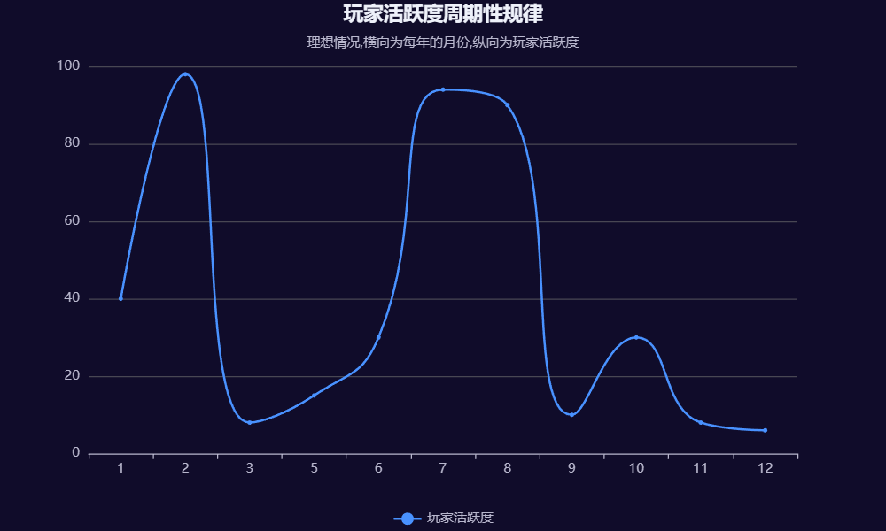

如图所示,对于主要面向中国玩家的服务器,玩家活跃度总会在每年的1至2月(寒假)和7至8月(有时包含6月底)达到高峰,随后就会跌入谷底,对应发展进程规律也就相当于进入了没落期,在10月由于国庆节往往可能会造成一波小型回升,但并不能持续过长时间,随后也会立刻陷入没落,如此循环往复,每年如此.

实际上,对于主要面向中国玩家的服务器,大多数情况下其在非寒暑假时,活跃度可能为零,上图只展示理想状态,也不包括服务器在治理过程中突然遭遇一些重大变故而导致直接消亡.

### 周期性定理:发展进程标准规律
此外,各种服务器具体问题的发展也具有一定的周期性,下图将以一般情况下暑假期间的服务器发展流程(对于主要面向中国玩家的服务器)为例,展示理想状态下各种服务器发展进程中可能存在的问题的强度预测(不适用于小游戏服务器,仅适用于大部分常规情况下的周目按假期轮回的服务器):

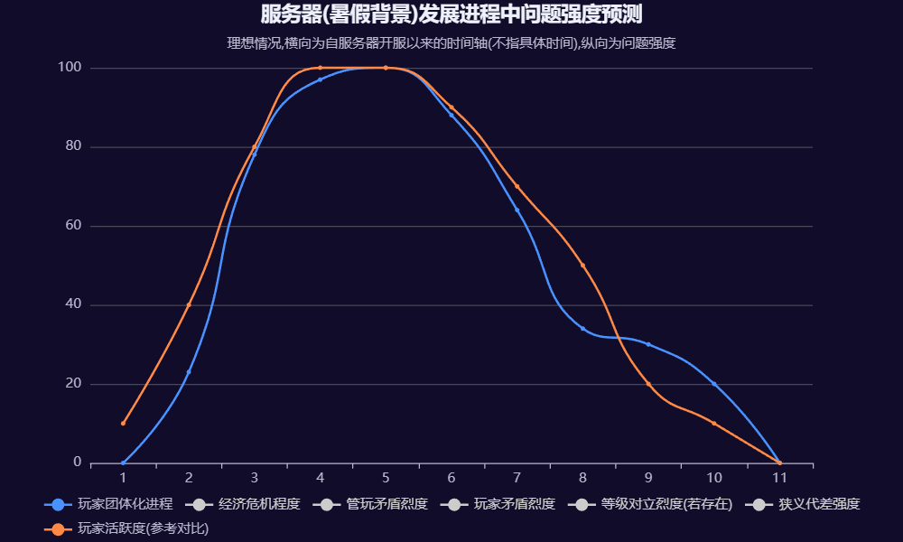

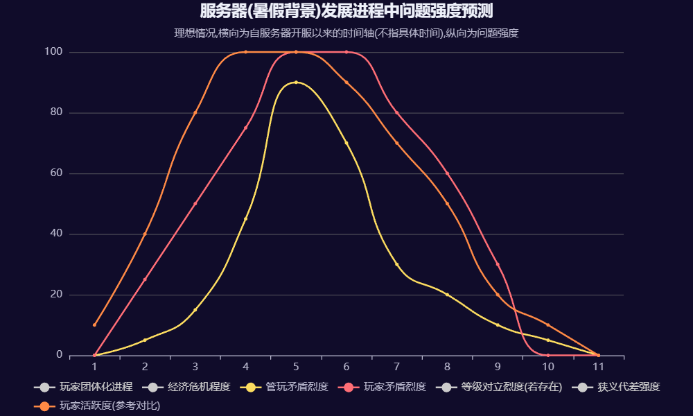

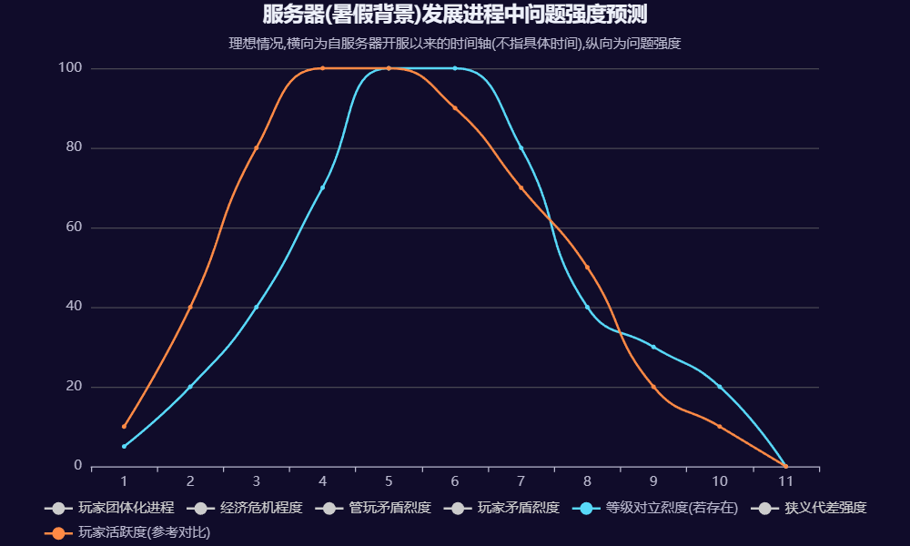

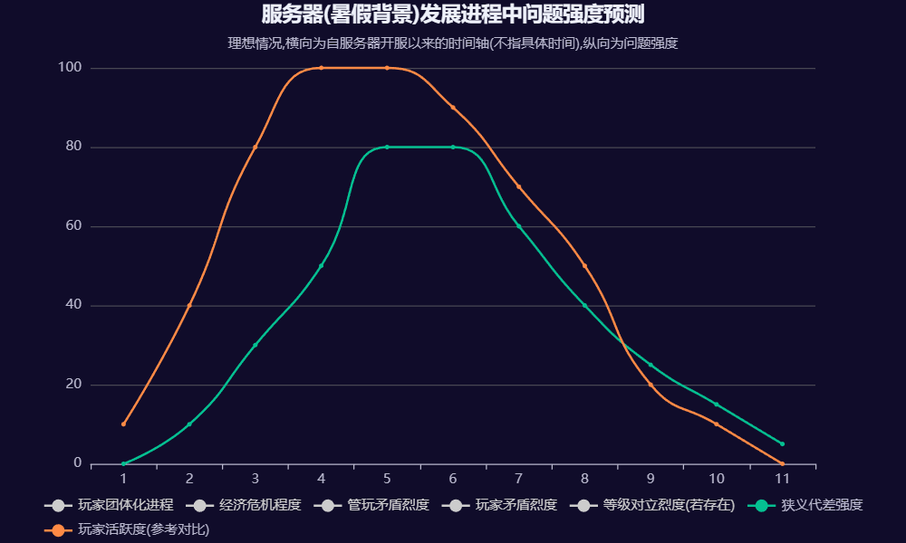

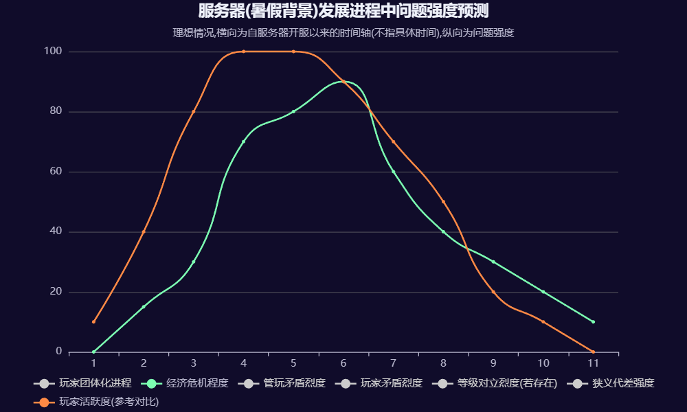

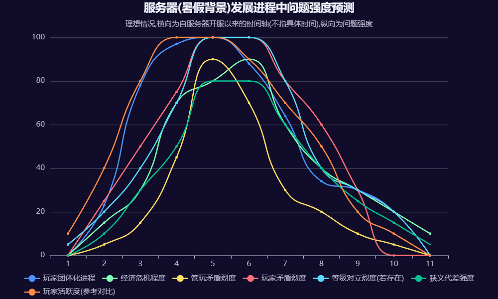

一般情况下,在这些服务器每个周目都会经历类似的轮回.大多数周目按假期轮回的服务器,一般情况下其基本玩法决定着必然要存在这样的规律,少部分情况下是服务器管理层的问题.其往往会采取多次宣传,因此,玩家活跃度也会呈现一定的周期性.

由玩家自发的游戏过程引发的各种问题,通常需要一个量的积累才能形成质变,从而显现出具体的表现形式,因此我们可以看见玩家活跃度的提高往往会先于各种问题.

### 周期性定理:制度与体系问题演化标准规律
此外对于各种制度体系的活跃度和问题爆发的数量及其严重性,也存在一定的周期性规律(不适用于制度非常成熟的服务器),如下图:

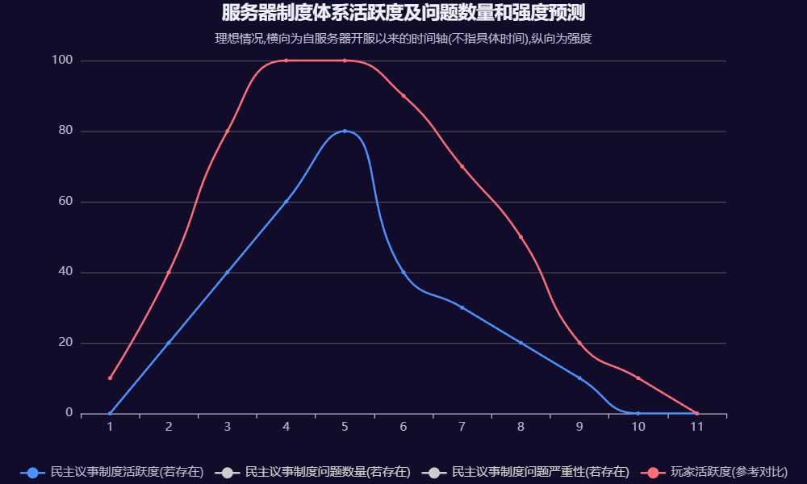

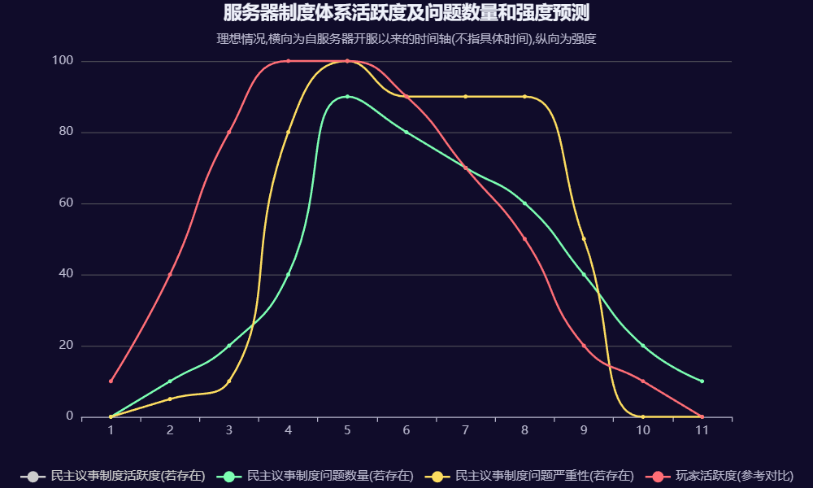

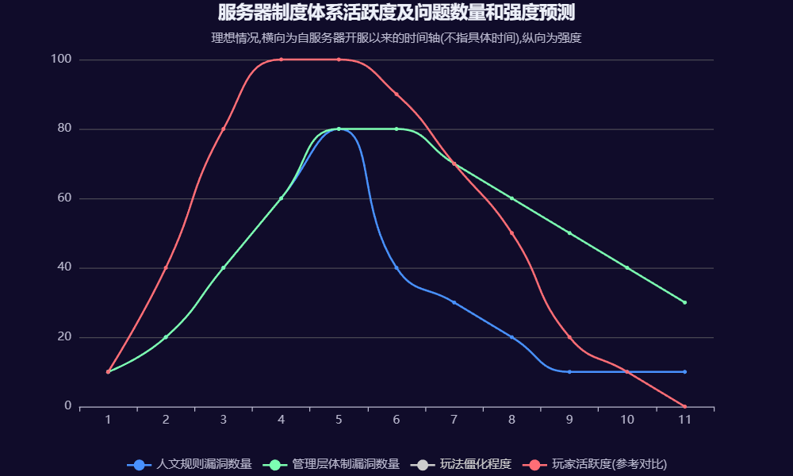

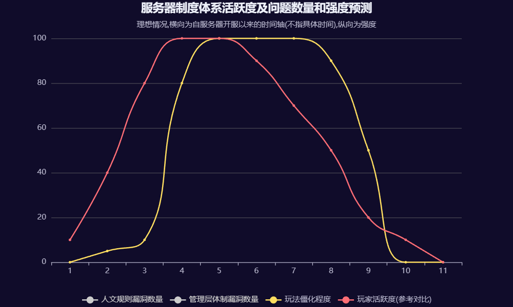

对于大多制度性问题,由于其需要玩家存在才能将其作用体现出来,因此当玩家活跃度降低时,其作用烈度也显著降低,这也进一步说明了玩家的重要性以及其作为对外开放的服务器的生命源泉的合理性.

### 周期性定理:具体问题具体分析原则
以上就是周期性定理的内容,实际上,大多数服务器在其实际演化中都会存在自己的独有的周期性,必须具体问题具体分析,但是其作用原理大多数情况下是相同的(例如只要服务器的玩家群体主要是现实中的学生,那么服务器就必然会因为学生开学而突然失去大量活跃玩家,不同服务器可能具体时间不同,但是都体现一定的相似性).以上是我们能够列举出来的最常见的周期性,不一定在所有服务器上都能体现,但是在同类型服务器中应该是最普遍的.

### 相似性定理:规律的相似性
对于相似性,主要分为两个方面.一方面就是对于存在按一定规律轮回周目(或具有周期性的规律)的服务器,其各种机制(如管理层体制等)往往都与以往周目(或已体现的规律)存在相似性,哪怕是玩家活跃度等高度依赖玩家个人情况的量,其依然体现着一定程度上的相似.也就是换周目(或规律进入新周期)这类操作或现象本身不具备大规模更改旧有体制的能力.

另一方面,对于存在一定的玩法雷同的各种服务器,其发展进程也具有相似性,例如圈钱的快餐服务器,其玩家等级对立的严重程度往往是相似的,且都会经历大规模由玩家等级对立引发的玩家矛盾和管玩矛盾的爆发,最终管理层在圈钱足够之后跑路.这就说明对于各种性质与玩法类似的服务器,除非其玩法做出了极大的更改形成了玩法特色,否则其发展依然与其他雷同服务器存在一定的相似性.

### 周期性与相似性定理的普遍性
周期性与相似性定理看似把话说绝了,实际上其就是直接反映了现实中开服的具体情况.我们需要根据服务器的具体情况进行具体问题具体分析,但是对于一些通用的周期性与相似性规律,其往往是适用的,是根据实践检验的,因此,我们将其称作周期性与相似性定理,而对于其他本文未列出的,由于其适用范围较小,或是较为少见不适用于最广大最常见的服务器,就没有列出.

大多数服务器都要经历如上的相似过程,一方面这是因为开服技术以及成本的降低带来的显著的问题,也就是导致大量的低质量雷同服务器的存在,其已然占据了整个开服圈子中最广大的份额,且该趋势是短期内无法消除的.

对于一些高质量服务器,上述周期性和相似性定理也是通用的,例如玩家活跃度的周期变化,每一年玩家人数总会随着寒暑假的到来而变化,因为这是取决于实际情况的通用的规律定理,我们没有办法做到强制改变规律,因为这些规律是客观存在的.

但是我们也不能因此就陷入悲观或无为,而是要积极地接受该规律,并利用周期性与相似性定理指导我们的实践.例如当我们清楚了玩家的活跃规律,就可以提前根据情况预测玩家活跃度,从而超前的提出一些制度设想等来超前解决一些问题,并提前做好规划,以便我们服务器更好地在重获新生的循环中快速让服务器进入繁荣阶段.

### 周期性定理:再看发展与超前
对于本章所述的周期性,并不是简单意义上的时间的循环,而是在服务器发展进程中各种不同的矛盾问题等引起的必然的体现,根据周期性,每一个发展阶段都有其对应的主要矛盾,与前文所述的各种问题相照应.

开服初期,玩家的活跃度提升,核心矛盾在于管理层体制的构建与完善,如果管理层不能及时建设一个合理的管理层体制,那么对于民主议事和人文规则也就无从谈起,因此开服初期的普遍药物就是寻找高素质管理员,尽可能预想可能发生的问题,并提前设好应对措施.

在兴盛与繁荣期,我们不能被服务器的兴盛蒙蔽了双眼,更要加强忧患意识,统筹解决玩家团体化问题,代差问题,经济危机问题等,从而处理好管玩矛盾与玩家矛盾,此时可根据实际情况真正践行民主议事机制.

在衰败的转折期,各种矛盾或者集中爆发,或者依次体现,例如管玩矛盾的激化,那么其根源究竟在哪?有时是初心问题,有时是能力问题.如果初心渐失则沦为特权化治理,如果能力不足则无法应对复杂局势.若此时管理层能秉持"向死而生"的勇气,积极自我革新,则服务器或许有可能寻得中兴的机会,若不能做到,则陷入消亡的宿命.

没落与重获新生,更多在于玩法的反思与人文规则的完善,我们经过了一定的实践尝试,也体验到了失败的痛苦,重开周目看似是时间的循环交替,实则是以空间换时间,重置了经济与代差问题,并用已有经验尽可能的延长服务器的繁荣期,对于保留周目的服务器,此时其一方面要召回老玩家,另一方面也要吸引新玩家,就需要其做出足够的制度与玩法创新,从而在新的周期创造出更加美丽的风采.

周期性看似是对前文的总结,实则是在前文的基础上升华出了最一般的要义,也是将服务器的诸问题真正的首次统一在一起,用发展的进程来依次分析,进行了一次完整的演绎.我们只有在发展的不同阶段,采取相应的适合实际情况的策略,既要视情况积极调整,又要在需要"以不变应万变"时有足够的定力,必须要坚定地走自己的路,而不是套用他人的路.

### 相似性定理:思维启示
相似性又揭露了一个事实:大多数服务器的轨迹相同,命运也要相同.但是在前文我们也说出了破局之法,也就是要实现自己的创新和螺旋式上升的发展.螺旋式上升不是原地转圈,我们需要吸取每一次服务器消亡的经验教训,将其作用于下一次服务器,对此,管理层必须做到以下三点:

①制度层面的辩证否定.每次轮回的结束都是一次反思的契机,天底下没有完美的制度,我们必须坚定辩证否定的思想,正确看待自身的不足.例如如果在上一次我们的民主制度流于形式,那么在这一次我们就要全方位地对其进行改革,保障其合理运行,或者说曾经货币体系是因为货币超发而崩溃的,那新周期就必须设置与其相对应的发行与回收机制.这样的对自身制度的辩证否定是我们实现超越相似性的根本所在.

②必须在玩法层面进行结构性创新.相似性的根源在于玩法同质化,管理层须于"精益求精"与"广撒网"之间寻求动态平衡,更须于二者之外探索玩法融合之新径.例如在小游戏服务器中设置RPG剧情游戏模式,就是自身的玩法不再局限于小游戏自身,而是成功做了一次加法,实现了自我的超越.这种结构性创新也一定程度上可以使服务器脱离旧有的发展轨迹,如果其能够被合理运用,也可以延长服务器的繁荣期,或是开创一种独特的生命周期.

③相信社区的力量,也就是要相信玩家群体的力量.我们要塑造一种合理的服务器社区风气,兼收如理性协商,团结合作等优良风气,以玩家之间的粘性超越自身制度或玩法的固有不足,也就形成了一种难以复制的核心竞争力.这需要管理层的长期培养,而不能指望一朝一夕的成功.

但我们也要清醒地认识到:打破相似性代价极高,成功率极低,大多数服务器终将在周期性与相似性规律中沉浮,这是必然存在的.但却如发展论指出,道路是曲折的,前途却是光明的.管理层的使命,不一定在于创造一个万古不灭的服务器,而是在每一次循环中都有所进步,为玩家带来更好的游戏体验,也为自身的留下了一份难以忘却的珍贵回忆,形成一种独特的人生智慧.

### 周期性与相似性定理的人文底蕴
这一定理也反向地考验着我们开服的初心,如果我们的开服就是为了名声大噪,那么必然要在周期性与相似性定理面前吃苦头,只有极少数的万里挑一的情况(例如开创无规则服务器先河的2b2t)或是商业运营的服务器才有可能成为名声大噪的服务器,很多情况下我们想要通过开服来名声大噪的想法是不能够如愿以偿的,因此我们可以说这一定理就是在劝诫那些是希望通过开服来为自己博得名声的.而对于那些真心希望在服务器游玩中与玩家们共同交流,共同进步,留下一段珍贵时光的管理者们,则更要乐观地看待服务器发展的前途,知晓该定理就是为了防止自身陷入虚无主义与悲观主义,更好地坚定自身的开服初心,也就是为了给所有人都留下一份美好的回忆而努力,这也是本论纲的核心:人文治理最终要回到人文,服务于玩家,作用于服务器,本论纲不以使服务器快速名声大噪为目的,而是向那些真心希望管理好服务器,为玩家们留下一份美好回忆的管理层们述说服务器人文治理的问题,帮助他们度过难关.

这一章就是本论纲的终章了,也是对全文的总结升华,我们前面所论述的内容,最终都归于以下内容:服务器人文治理的核心要义,就在于维持多力量中心制衡格局的动态平衡,以制度的确定性应对人的不确定性,以螺旋式上升超越简单的循环.同时,我们必须要警惕"唯结果论"的错误,不能只看结果而忽视了过程,必须意识到服务器人文治理没有绝对明确而通用的具体方法论,从而做到不盲目套用所谓的成功案例,并更加重视他人提出的合理的问题而不是偏执地要求他人提出问题时必须带上具体解决方法,我们自身也不能盲目地只重视结果的好坏而轻视了具体问题与发展过程,否则就容易陷入功利主义的泥潭或是形成了形而上学的固化思维,更不利于服务器的长期发展.总之,对于服务器人文治理,最大的方法论就是必须要做到具体问题具体分析.
### 总结
我们要做到具体问题具体分析,就必须在服务器的实际治理中将自身已有的知识(如哲学或逻辑学知识)合理运用到实际问题的解决,而不是停留在理论层面.同时,我们也必须铭记"原理可能是相似的,原则也可能是通用的,但是具体方法不是上天赏赐的,更不是他人恩赐的,而是自身在实践中不断探索出的"这一思想原则,重视从实践检验中发现的问题,并根据实际情况运用合理的方法解决问题,而不是盲目地相信脱离了实际情况的所谓的最佳解决方案,或是自满于现状而失去了不断进步的斗志.可以说,我们自身优异的道德水平与理性的思维是更加重要的,因此我们必须要收起自身在互联网中的戾气,而不是展现出高高在上的凌驾之势或是不重视自身言论后果的一面.

当真正想要使服务器人文治理变得更好的管理者们真正静下心来阅读到此时,其或许没有获得多么有指导性开创性的方法论,但是其在这一过程中培养了其心性,净化了其思想,开拓了其眼界,了解到了以现实中的理论指导服务器人文治理的重要性,知道了人文问题的作用原理,也就能更好地根据服务器的情况去分析服务器的实际需求,从而因地制宜地把服务器建设好管理好,这便是本论纲的目的,以及初心使命.

本论纲正式内容到此结束,无论您持有何种态度,本论纲作者Al2(SO4)3-硫酸铝都将十分感谢您能够花费您人生中最宝贵的时间来阅读本论纲.

